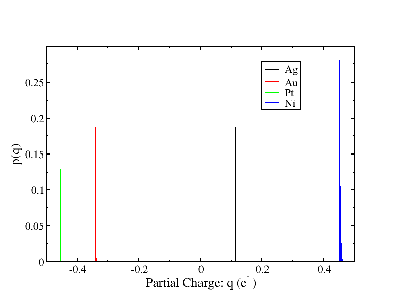
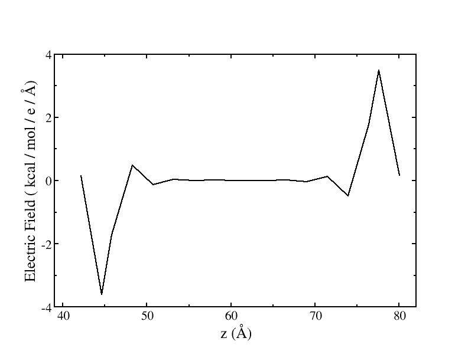
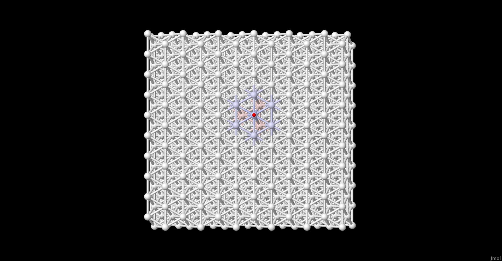
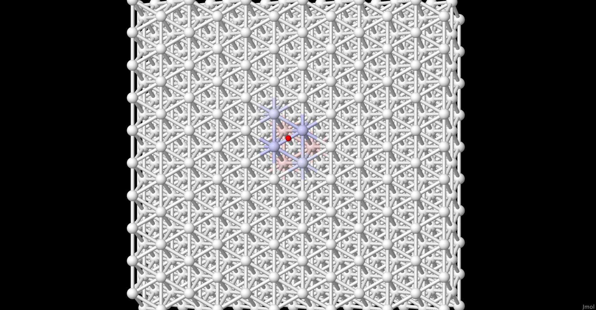
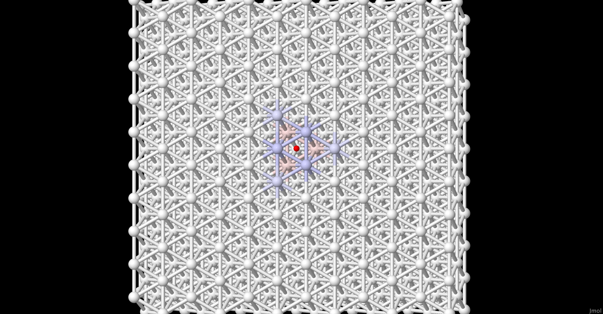

# Density Readjusting Embedded Atom Method (DR-EAM)
The samples in this directory illustrate a new method for simulating
bulk metals while treating polarizability.

## Background Information
The Density Readjusting Embedded Atom Method (DR-EAM):

> Bhattarai, H., Newman, K. E., & Gezelter, J. D. (2019). Polarizable potentials for metals:
> The density readjusting embedded atom method (DR-EAM). Physical Review
> B, 99(9), 94106, doi: 10.1103/PhysRevB.99.094106

allows fluctuating densities within the framework of the Embedded Atom
Method (EAM):

> Daw, M. S., & Baskes, M. I. (1984). Embedded-atom method: Derivation
> and application to impurities, surfaces, and other defects in
> metals. Physical Review B, 29(12), 6443–6453. doi:
> 10.1103/PhysRevB.29.6443

by adding an additional degree of freedom, the charge for each atomic
site.  The samples here illustrate the use of DR-EAM in bulk metals,
surfaces, and alloys.

## Instructions

### Ordered Structures

In the `orderedStructures`  directory, are two alloy samples: Ag<sub>3</sub>Au in
the $L1_{2}$ structure and PtNi in the $L1_{0}$ structure.  Both of the `omd` files in this directory describe structure optimizations, and not molecular dynamics. The `omd` files have a block to use Conjugate Gradient `CG` as the method for finding the optimal structure:

```C++
minimizer {
  useMinimizer = true;
  method = CG;
  maxIterations = 5000;
}
```
These files also turn on the fluctuating charge module to use DR-EAM.  Here, the target temperature for the electronic degrees of freedom is set very low (1K):
```C++
flucQ {
  propagator = "Langevin";
  targetTemp = 1;
  dragCoefficient = 0.1;
}
```

To carry out these optimization runs, we would use these commands:

```bash
openmd AgAuL12.omd
openmd PtNiL10.omd
```

OpenMD will simultaneously optimize the structure and the partial charges on the atoms.  Once the structures have been optimized, we can look at the charges (`q`) that have been assigned to the types of atoms at the end of the run (in the `eor` file):

```bash
StaticProps -i AgAuL12.eor -q --sele1="select Ag_FQ" -o Ag.chargeHist
StaticProps -i AgAuL12.eor -q --sele1="select Au_FQ" -o Au.chargeHist
StaticProps -i PtNiL10.eor -q --sele1="select Pt_FQ" -o Pt.chargeHist
StaticProps -i PtNiL10.eor -q --sele1="select Ni_FQ" -o Ni.chargeHist
```
These calculate the distribution of partial charges assigned to particular types of atoms.  Plotting these:

```bash
xmgrace Ag.chargeHist Au.chargeHist Pt.chargeHist Ni.chargeHist
```
we should expect to see Ag and Au with opposing charges (but in a 3:1 ratio), and Pt and Ni with opposing charges.

### Field Screening

One of the properties of a metal is the ability to screen atoms internal to the slab from external electric fields. The sample in the `fieldScreening` subdirectory  is a Platinum slab simulated in the presence of an external electric field.  The relevant portions of that sample file add a few new items to the simulation definition:
```C++
flucQ {
  propagator = "Langevin";
  targetTemp = 1;
  dragCoefficient = 0.1;
}
outputFluctuatingCharges = true;   # we want to see the charges layer-by-layer
outputElectricField = true;        # we want to measure the field inside the slab
outputDensity = true;              # helps us look at the electron density
useSurfaceTerm = "true";           # Adds an important term in electrostatic interactions
uniformField = (0,0,1e-2);         # an exeternal electric field along the z-axis
```
Running and analyzing this simulation, we would run (note that this is a very long simulation):
```bash
mpirun -np 4 openmd_MPI PtSlab.omd
```
To analyze the data, we're going to look primarily at the local electric field and we can get to this value using the `--rnemdz` option in `StaticProps`:
```bash
StaticProps -i PtSlab.dump --rnemdz --nbins=100
awk 'NF>3 || $1=="#"' < PtSlab.rnemdZ > PtSlab.data
xmgrace -block PtSlab.data -bxy 1:10
```
The `awk` command above strips out data lines from `PtSlab.rnemd` which 
don't have the right number of fields. This can happen when there are no 
atoms present in some parts of the simulation cell.

The Electric Field is in columns 8,9, and 10 of the rnemdZ
data file, so we'll pull out only the *z*-component with the 
`xmgrace` command.

### Image charges

Metal surfaces should respond to nearby ions by creating an *image charge*. This happens when the electron density in the metal towards (or away) from the positively-charged (or negatively charged) ion. The `imageCharge` directory has three samples which explore this property from three sites above the surface:

```bash
openmd atop.omd
openmd bridge.omd
openmd hollow.omd
```
To look at the charges on the metal surface we'd do the following:
```bash
Dump2XYZ -i atop.eor -c -b 
Dump2XYZ -i bridge.eor -c -b
Dump2XYZ -i hollow.eor -c -b
```
This creates xyz files from the end-of-run (eor) file which have partial charges added to each atom.  We can visualize these in jmol

```bash
jmol atop.xyz
jmol bridge.xyz
jmol hollow.xyz
```
A very useful command in jmol is
- *File -> Console...*

In the console window, type `color partialCharge` and hit return.  The blue colors indicate copper atoms that have taken on a positive partial charge, and the red/pink colors are copper atoms with negative positive charges.

## Expected Output

For the Alloys, we expect distributions of partial charges that look like:


For the Field screening simulation, we expect the *z*-component of 
electric field to look like:



Note that the DR-EAM atoms feel almost none of the external electric 
field in the middle of the slab.  The polarization of the surface atoms
has effectively shielded the interior atoms.

For the image charge simulations, sample charge images are shown below:

<p float="left">
  
  
  
</p>
