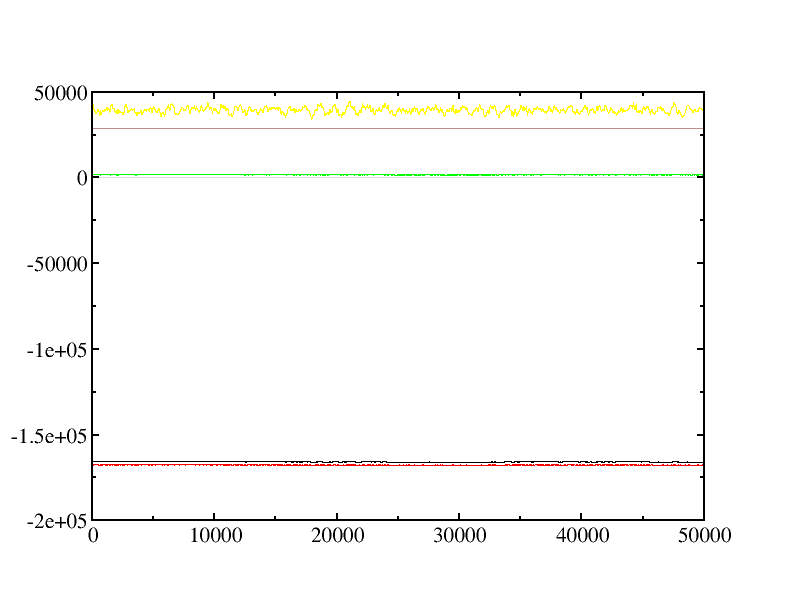

# Langevin Hull

## Background Information
This directory contains sample files for carrying out isobaric-isothermal (NPT)
simulations for non-periodic systems using the Langevin Hull.  Further details on the Langevin Hull integrator can be found in:

> Charles F. Vardeman II, Kelsey M. Stocker and J. Daniel Gezelter, “The 
> Langevin Hull: Constant pressure and temperature dynamics for 
> non-periodic systems,” J. Chem. Theory Comput. 7(4), 834-842 (2011)
> DOI: 10.1021/ct100670m

## Instructions

In general, to use the `LangevinHull` integrator, you'll want include
these lines in your `.omd` file:

```C++  		   	
ensemble = "LangevinHull";
targetTemp = 300;
targetPressure = 100;
viscosity = 0.0089;
usePeriodicBoundaryConditions = "false";
```

The bath is characterized by a pressure, temperature, and viscosity,
so these keywords are required, but the values depend on what you are
trying to simulate.

Note that the time required for thermal equilibration depends on
exposed surface area and bath viscosity.

| Input File       |    Composition       | Bath Properties              |
|------------------|----------------------|------------------------------|
| *SPC/E Water clusters:* |               |                              |
| spce_1atm.omd    | 1372 SPC/E cluster   |   1 atm, 300 K, 0.0089 Poise |
| spce_100atm.omd  | 1372 SPC/E cluster   | 100 atm, 300 K, 0.0089 Poise |
| *Gold nanospheres:* |                   |                              |
| Au_300K.omd      | 20 A radius (1985 Au)  | 4 GPa, 300K, 0.0089 Poise  |
| Au_lowvisc.omd   | 40 A radius (15707 Au) | 4 GPa, 400K, 0.0089 Poise  |
| Au_highvisc.omd  | 40 A radius (15707 Au) | 4 GPa, 400K, 0.07288 Poise |
| *18 A gold nanospheres in Water:* |       |                            |
| spce_Au_1atm.omd | 1433 Au + 5000 SPC/E   | 1 atm, 300K, 0.0089 Poise  |
| spce_Au_100atm.omd | 1433 Au + 5000 SPC/E |100 atm, 300K, 0.0089 Poise |

To run one of these simulations (in parallel), you would enter this command:

```bash
mpirun -np 4 openmd_MPI Au_300K.omd
```

Note that this simulation is fairly large and will take a relatively long time (when compared with other samples).

## Expected Output

The report that is generated indicates the thermodynamic averages.  Note that the mean temperature of 299.961 K is quite close to the target temperature, and the mean internal pressure (39567.1 atm) is almost exactly the target (4GPa).
```
###############################################################################
# Status Report:                                                              #
#              Total Time:       50000 fs                                     #
#       Number of Samples:       12501                                        #
#            Total Energy:     -165728  ±  0.771139     kcal/mol              #
#        Potential Energy:     -167502  ±  0.555357     kcal/mol              #
#          Kinetic Energy:     1773.95  ±  0.56464      kcal/mol              #
#             Temperature:     299.961  ±  0.0954758    K                     #
#                Pressure:     39567.1  ±  29.135       atm                   #
#                  Volume:     28672.7  ±  0.43814      A^3                   #
#      Conserved Quantity:           0  ±  0            kcal/mol              #
###############################################################################
```

The time-sequence of the thermodynamic variables can be plotted using
```bash
xmgrace -nxy Au_300K.stat
```
The plot of these same thermodynamic variables sampled during the simulation should resemble:



The colors here correspond to 
- black: total energy (kcal / mol)
- red: potential energy (kcal / mol)
- green: kinetic energy (kcal / mol)
- blue: temperature (K)
- yellow: pressure (atm)
- brown: volume (angstroms^3)
- grey: conserved quantity (kcal / mol) note that there is no conserved quantity in Langevin-based simulations.
