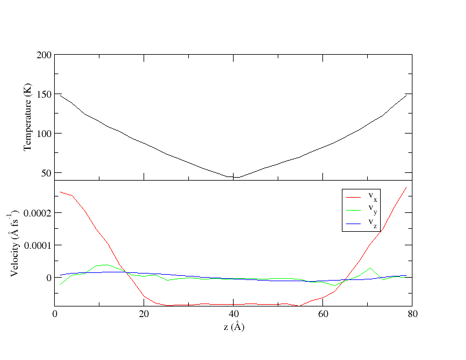

# Reverse Non-Equilibrium Molecular Dynamics (RNEMD)

## Background Information

There are many ways to compute transport properties from molecular
dynamics simulations.  Equilibrium Molecular Dynamics (EMD)
simulations can be used by computing relevant time correlation
functions and assuming linear response theory holds.  For some transport
properties (notably thermal conductivity), EMD approaches
are subject to noise and poor convergence of the relevant
correlation functions. Traditional Non-equilibrium Molecular Dynamics
(NEMD) methods impose a gradient (e.g. thermal or momentum) on a
simulation.  However, the resulting flux is often difficult to
measure. Furthermore, problems arise for NEMD simulations of
heterogeneous systems, such as phase-phase boundaries or interfaces,
where the type of gradient to enforce at the boundary between
materials is unclear.

*Reverse* Non-Equilibrium Molecular Dynamics (RNEMD) methods adopt
a different approach in that an unphysical *flux* is imposed between
different regions or "slabs" of the simulation box.  The goal of RNEMD
methods is to calculate the relevant transport property ($\lambda$)
that connects the flux ($\textbf{J}$) and driving force ($\nabla X$)
according to the generalized equation,

$$
\textbf{J} = - \lambda \nabla X.
$$

Since the amount of the applied flux is known exactly, and the measurement of
gradient is generally less complicated, imposed-flux methods typically take
shorter simulation times to obtain converged results for transport properties.

## Instructions

Unless explicitly mentioned, you can run `openmd` on all these examples
mentioned below with the following command:

```bash
mpirun -np 4 openmd_MPI <sample_file>.omd
```

### Example 1

The file `shearWater.omd` is a box of 1500 SPC/E water molecules
which has the momentum flux functionality of RNEMD turned on. Notice
in the RNEMD block of the (.omd) file that

```C++
RNEMD {
  fluxType = "Px";
  momentumFlux = 6.0e-7;
  // ...
}
```

With these parameters, the applied flux will be an x-axis momentum
flux transferred across the z-dimension of the box. Using this
functionality, one is able to measure the *shear viscosity* of the
liquid at the simulated temperature by relating the imposed momentum
flux to the system's gradient response of the velocity.

### Example 2

It is also possible to measure the *thermal conductivity* of a
material using the RNEMD functionality in OpenMD. As an example,
`graphene.omd` is an (.omd) file where two sheets of graphene have a
thermal flux applied across the long axis of the sheet. In the (.omd)
file the fluxType has been set to a kinetic energy flux, and also that
the kineticFlux is defined.

```C++
RNEMD {
  fluxType = "KE";
  kineticFlux = -6.55e-11;
  // ...
}
```

The system responds to the thermal flux by developing a temperature
gradient across the z-axis of the system. The thermal conductivity can
be computed by relating the resulting thermal gradient to the imposed
kinetic energy flux.

Since we have just two molecules in this example, openmd won't allow
parallelization of more than 2 cores, so we can just run the following:

```
openmd graphene.omd
```

### Example 3

While computing the thermal conductivity of a bulk material is
certainly of interest, one may also want to investigate interfacial
thermal conductance across an interface. The RNEMD functionality of
OpenMD easily allows for this, and the RNEMD definition block in the
(.omd) file only needs a minor tweaks.  Before our selection, was of
only one component, now we need to allow for more than one atom or
molecule type to be selected.

`gold_water_interface.omd` is an example system where we can compute
the thermal conductivity across an interface, here, a gold / water
interface. Notice in the RNEMD declaration block in the (.omd) file
that the objectSelection is now,

```C++
RNEMD {
  objectSelection = "select SPCE_RB_0 or Au";
  // ...
}
```

It is important to make sure your simulation cell is constructed
properly for these kinds of simulations. Since the two RNEMD exchange
regions are defined along the z-dimension at the middle of the
simulation cell and at the far edges (wrapping about the periodic
box), the gold and water need to be properly distributed throughout
the box or else your computation will not give you what you want.

### Example 4

The file `2744_shear.omd` is a box of 2744 Argon atoms which has a
simultaneous momentum and kinetic energy flux through the box. In the
middle of the simulation cell is a lattice structure which has interesting
implications for the velocity profiles (see [below](#expected-output)).
Notice this in the RNEMD block of the (.omd) file:

```C++
RNEMD {
  fluxType = "KE+Pvector";
  kineticFlux = -5.0e-6;
  momentumFluxVector = (-2e-7, 0, 0);
  // ...
}
```

along with definitions for both *kineticFlux* and *momentumFluxVector*.

Application of simultaneous momentum and kinetic energy fluxes result
in both a velocity and thermal gradient response of the system,
allowing for measurement of the shear viscosity of the fluid at a
large number of temperature domains with one simulation.

### Example 5

OpenMD can perform non-periodic simulations using the Langevin Hull
along with the RNEMD functionality, allowing for computation of
thermal conductance across solvated nanoparticle interfaces. OpenMD
hosts a large number of builder utility scripts which aide in the
construction of these nanoparticles (nanospheres, icosohedra,
cuboctahedra), which can be found in [here](../builders/README.md).

`NP20_hex_KEflux.omd` is an example of a Gold nanosphere solvated in
hexane, with a kinetic energy flux that moves thermal energy from
the solvent into the particle. The RNEMD declaration block in the
(.omd) file is only slightly different than above. The syntax is
described in detail in the OpenMD manual.

```C++
RNEMD {
  useRNEMD = "true";
  objectSelection = "select Au or Hexane";
  sphereAradius = 10;
  sphereBradius = 41;
  method = "VSS";
  fluxType = "KE";
  kineticFlux = 1E-5;
  exchangeTime = 10;
  outputBins = 60;
}
```

The only notable change to the RNEMD declaration block is the addition
of *sphereAradius* and *sphereBradius*, which define the two exchange
regions for the RNEMD moves.

### Example 6

One of the newer techniques in our RNEMD module allows for the application
of a particle flux by moving particles slowly from one region of the
simulation box to another. Note here that all previous examples have been
perturbing velocities, whereas this scaled particle flux (SPF) method perturbs
molecular positions. The file `spf.omd` contains a similar structure to that
of the `2744.omd` file with the following noticeable changes:

```C++
RNEMD {
  fluxType = "Particle";
  method = "spf";
  particleFlux = 5e-7;
  outputFields = "Z|TEMPERATURE|VELOCITY|DENSITY|ACTIVITY";
  // ...
}
```

These simulations usually take quite a bit longer than the other methods
discussed and result in some amount of failed exchanges. This is normal
for the method due to the simulation's sensitivity to potential energy
changes (something unique to SPF-RNEMD).

## Expected Output

In [Example 4](#example-4) we apply both a thermal flux and a momentum
flux in the x-direction. With RNEMD, a new output file type is introduced,
the `.rnemd` file. These files are human readable, offering a large amount
of information about the simulation details:

```
#######################################################
# RNEMD {
#    exchangeMethod  = "VSS";
#    fluxType  = "KE+Pvector";
#    privilegedAxis = z;
#    exchangeTime = 50;
#    objectSelection = "select Ar";
#    selectionA = "select wrappedz >= -4.00005 && wrappedz < 4.00005";
#    selectionB = "select wrappedz >= 36.0005 || wrappedz < -36.0005";
#    outputSelection = "select Ar";
# }
#######################################################
# RNEMD report:
#      running time = 100001 fs
# Target flux:
#           kinetic = -5e-06 (kcal/mol/A^2/fs)
#          momentum = [ -2e-07, 0, 0 ] (amu/A/fs^2)
#  angular momentum = [ 0, 0, 0 ] (amu/A^2/fs^2)
#          particle = 0 (particles/A^2/fs)
# Target one-time exchanges:
#          kinetic = -0.80002096 (kcal/mol)
#          momentum = [ -0.032000838, 0, 0 ] (amu*A/fs)
#  angular momentum = [ 0, 0, 0 ] (amu*A^2/fs)
#          particle = 0 (particles)
# Actual exchange totals:
#          kinetic = -1600.0419 (kcal/mol)
#          momentum = [ -64.001677, 0, 0 ] (amu*A/fs)
#  angular momentum = [ 0, 0, 0 ] (amu*A^2/fs)
#         particles = 0 (particles)
# Actual flux:
#          kinetic = -4.99995e-06 (kcal/mol/A^2/fs)
#          momentum = [ -1.99998e-07, 0, 0 ] (amu/A/fs^2)
#  angular momentum = [ 0, 0, 0 ] (amu/A^2/fs^2)
#          particle = 0 (particles/A^2/fs)
# Exchange statistics:
#               attempted = 2000
#                  failed = 0
#######################################################
```

By plotting the output of the RNEMD simulation,

```
xmgrace -nxy 2744_shear.rnemd
```

we can visualize the effect these fluxes have on the temperature and velocity
profiles, noticing smooth gradients that develop as a response to our applied
fluxes. As we mentioned in the example, the simulation cell contains a lattice
of argon atoms in the middle, hence the larger region with no velocity
gradient.


