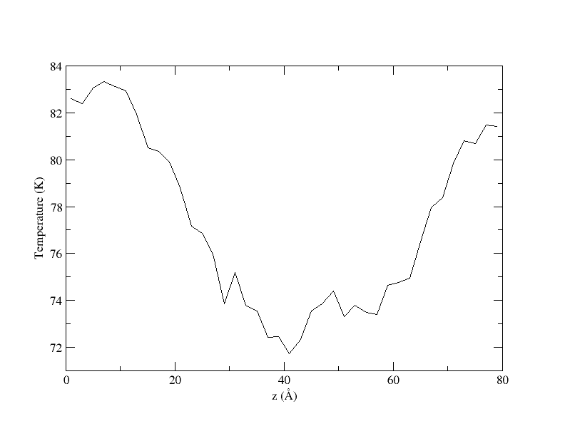
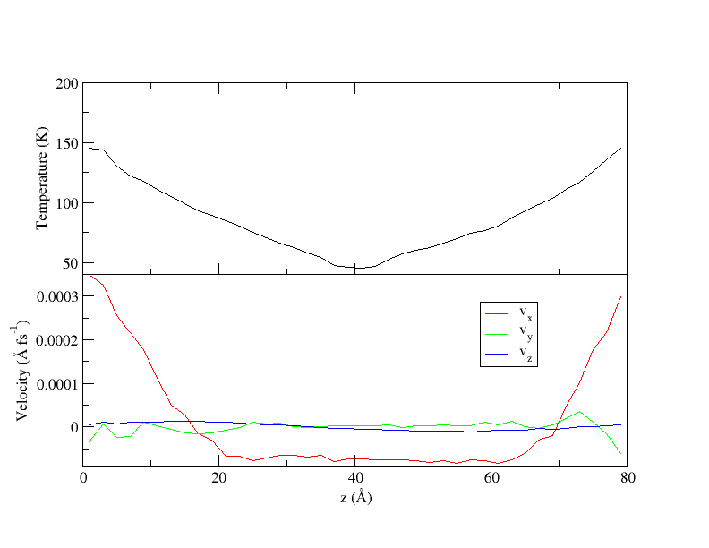
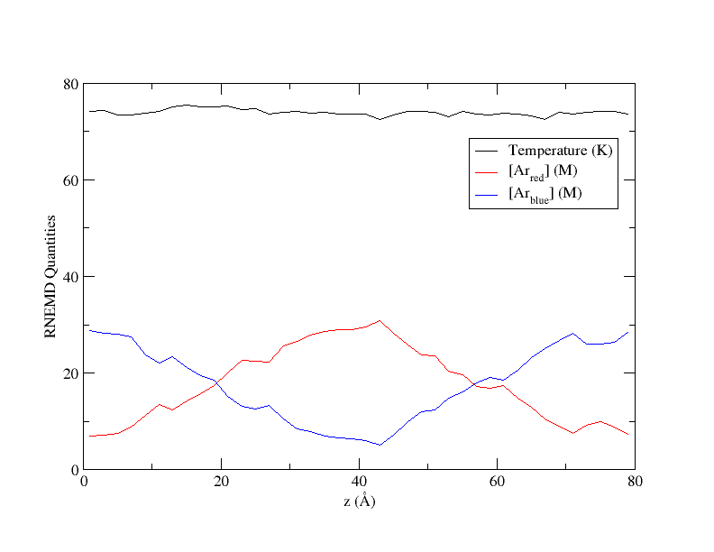

# Reverse Non-Equilibrium Molecular Dynamics (RNEMD)

## Background Information

There are many ways to compute transport properties from molecular
dynamics simulations.  Equilibrium Molecular Dynamics (EMD)
simulations can be used by computing relevant time correlation
functions and assuming linear response theory holds.  For some transport
properties (notably thermal conductivity), EMD approaches
are subject to noise and poor convergence of the relevant
correlation functions. Traditional Non-equilibrium Molecular Dynamics
(NEMD) methods impose a gradient (e.g. thermal or momentum) on a
simulation.  However, the resulting flux is often difficult to
measure. Furthermore, problems arise for NEMD simulations of
heterogeneous systems, such as phase-phase boundaries or interfaces,
where the type of gradient to enforce at the boundary between
materials is unclear.

*Reverse* Non-Equilibrium Molecular Dynamics (RNEMD) methods adopt
a different approach in that an unphysical *flux* is imposed between
different regions or "slabs" of the simulation box.  The goal of RNEMD
methods is to calculate the relevant transport property ($\lambda$)
that connects the flux ($\textbf{J}$) and driving force ($\nabla X$)
according to the generalized equation,

$$
\textbf{J} = - \lambda \nabla X.
$$

Since the amount of the applied flux is known exactly, and the measurement of
gradient is generally less complicated, imposed-flux methods typically take
shorter simulation times to obtain converged results for transport properties.

## Instructions

### Example 1

For our first test of the functionality in the RNEMD module, we'll start 
with a simple test of applying a kinetic energy flux on a system of 2744 
Argon atoms. Take a look at the RNEMD block in the `2744.omd` file:

```C++
RNEMD {
  useRNEMD = true;
  exchangeTime = 1.0;
  outputBins = 40;
  objectSelection = "select Ar";
  fluxType = "KE";
  method = "VSS";
  kineticFlux = -2e-9;
  outputFields = "Z|TEMPERATURE|VELOCITY|DENSITY";
}
```

A couple things of note here are the `fluxType` and `method` parameters. 
These signify that the algorithm type we're using is the VSS-RNEMD algorithm 
which has been shown to be quite good in measuring thermal conductivities 
from molecular dynamics simulations, hence the `KE`, a.k.a. thermal, flux type.

To run this simulation, we'd reccommend adding a few extra cores with the 
following command:

```bash
mpirun -np 4 openmd_MPI 2744.omd
```

### Example 2

The file `2744_shear.omd` is a box of 2744 Argon atoms which has a
simultaneous momentum and kinetic energy flux through the box. In the
middle of the simulation cell is a lattice structure which has interesting
implications for the velocity profiles. Notice this in the RNEMD block of 
the (`.omd`) file that we've swapped our `fluxType` to these combined thermal 
and momentum fluxes:

```C++
RNEMD {
  // ...
  fluxType = "KE+Pvector";
  method = "VSS";
  kineticFlux = -5.0e-6;
  momentumFluxVector = (-2e-7, 0, 0);
}
```

along with definitions for *both* `kineticFlux` and `momentumFluxVector`.

Application of simultaneous momentum and kinetic energy fluxes result
in both a velocity and thermal gradient response of the system,
allowing for measurement of the shear viscosity of the fluid at a
large number of temperature domains with one simulation.

This simulation can be run with the following command:

```bash
mpirun -np 4 openmd_MPI 2744_shear.omd
```

### Example 3

One of the newer techniques in our RNEMD module allows for the application
of a particle flux by moving particles slowly from one region of the
simulation box to another. Note here that all previous examples have been
perturbing velocities, whereas this scaled particle flux (SPF) method perturbs
molecular positions. The file `2744_particle.omd` contains a similar structure 
to that of the `2744.omd` file with some noticeable changes. First, we still 
have 2744 Argon atoms, but we've colored half of them red and half of them blue.
This becomes important in the RNEMD block, which now looks like this:

```C++
RNEMD {
  // ...
  objectSelection = "select Ar_blue";
  outputSelection = "select all";
  fluxType = "Particle";
  method = "spf";
  particleFlux = 6.25e-8;
  outputFields = "Z|TEMPERATURE|VELOCITY|DENSITY|ACTIVITY";
}
```

Here, we're only moving the blue atoms, but we still want to print out statistics
on all atoms, hence the different `objectSelection` and `outputSelection` variables.
SPF-RNEMD is its own method, so we need to specify that. This file is an equilibrated
box of Argon atoms, so the structure is different from the other 2744 boxes which
have a lattice structure in the middle. Also very important is the addition of a seed
in the `.omd` file. SPF-RNEMD introduces some randomness, so if we want consistent 
results, we need to seed the random number generator.

Run this command and wait a while for the simulation to finish:

```bash
mpirun -np 4 openmd_MPI 2744_particle.omd
```

These simulations usually take quite a bit longer than the other methods
discussed and result in some amount of failed exchanges. This is normal
for the method due to the simulation's sensitivity to potential energy
changes (something unique to SPF-RNEMD). 

### Example 4

While computing the thermal conductivity of a bulk material is
certainly of interest, one may also want to investigate interfacial
thermal conductance across an interface. The RNEMD functionality of
OpenMD easily allows for this, and the RNEMD definition block in the
(`.omd`) file only needs a minor tweaks.  Before, our selection was of
only one component, now we need to allow for more than one atom or
molecule type to be selected.

`gold_water_interface.omd` is an example system where we can compute
the thermal conductivity across an interface, here, a gold / water
interface. Notice in the RNEMD declaration block in the (`.omd`) file
that the objectSelection is now,

```C++
RNEMD {
  objectSelection = "select SPCE_RB_0 or Au";
  // ...
}
```

It is important to make sure your simulation cell is constructed
properly for these kinds of simulations. Since the two RNEMD exchange
regions are defined along the z-dimension at the middle of the
simulation cell and at the far edges (wrapping about the periodic
box), the gold and water need to be properly distributed throughout
the box or else your computation will not give you what you want.

Run this command to see what the gold / water interface looks like under
a thermal flux:

```bash
mpirun -np 4 openmd_MPI gold_water_interface.omd
```

### Example 5

The file `shearWater.omd` is a box of 1500 SPC/E water molecules which
has the momentum flux functionality of RNEMD turned on. Notice the RNEMD 
block of the (`.omd`) file:

```C++
RNEMD {
  fluxType = "Px";
  momentumFlux = 6.0e-7;
  // ...
}
```

With these parameters, the applied flux will be an x-axis momentum
flux transferred across the z-dimension of the box. Using this
functionality, one is able to measure the *shear viscosity* of the
liquid at the simulated temperature by relating the imposed momentum
flux to the system's gradient response of the velocity.

```bash
mpirun -np 4 openmd_MPI shearWater.omd
```

### Example 6

OpenMD can perform non-periodic simulations using the Langevin Hull
along with the RNEMD functionality, allowing for computation of
thermal conductance across solvated nanoparticle interfaces. OpenMD
hosts a large number of builder utility scripts which aide in the
construction of these nanoparticles (nanospheres, icosohedra,
cuboctahedra), which can be found in [here](../builders/README.md).

`NP20_hex_KEflux.omd` is an example of a Gold nanosphere solvated in
hexane, with a kinetic energy flux that moves thermal energy from
the solvent into the particle. The RNEMD declaration block in the
(`.omd`) file is only slightly different than above. The syntax is
described in detail in the OpenMD manual.

```C++
RNEMD {
  useRNEMD = "true";
  objectSelection = "select Au or Hexane";
  sphereAradius = 10;
  sphereBradius = 41;
  method = "VSS";
  fluxType = "KE";
  kineticFlux = 1E-5;
  exchangeTime = 10;
  outputBins = 60;
}
```

The only notable change to the RNEMD declaration block is the addition
of `sphereAradius` and `sphereBradius`, which define the two exchange
regions for the RNEMD moves as spheres instead of rectangular slabs as
we've seen before.

This command will take a while to run due to the box size and number of
molecules present:

```bash
mpirun -np 4 openmd_MPI NP20_hex_KEflux.omd
```

## Expected Output

### Example 1

In all the examples above we apply a flux and force the system to respond with
a gradient. With RNEMD, a new output file type is introduced, the `.rnemd` file.
These files are human readable, offering a large amount of information about
the simulation details. For the Argon system under a thermal flux, that looks
something like this:

```
#######################################################
# RNEMD {
#    exchangeMethod  = "VSS";
#    fluxType  = "KE";
#    privilegedAxis = z;
#    exchangeTime = 1;
#    objectSelection = "select Ar";
#    selectionA = "select wrappedz >= -4.00005 && wrappedz < 4.00005";
#    selectionB = "select wrappedz >= 36.0005 || wrappedz < -36.0005";
#    outputSelection = "select Ar";
# }
#######################################################
# RNEMD report:
#      running time = 100001 fs
# Target flux:
#           kinetic = -2e-09 (kcal/mol/A^2/fs)
#          momentum = [ 0, 0, 0 ] (amu/A/fs^2)
#  angular momentum = [ 0, 0, 0 ] (amu/A^2/fs^2)
#          particle = 0 (particles/A^2/fs)
# Target one-time exchanges:
#          kinetic = -6.4001677e-06 (kcal/mol)
#          momentum = [ 0, 0, 0 ] (amu*A/fs)
#  angular momentum = [ 0, 0, 0 ] (amu*A^2/fs)
#          particle = 0 (particles)
# Actual exchange totals:
#          kinetic = -0.64001677 (kcal/mol)
#          momentum = [ 0, 0, 0 ] (amu*A/fs)
#  angular momentum = [ 0, 0, 0 ] (amu*A^2/fs)
#          particle = 0 (particles)
# Actual flux:
#          kinetic = -1.99998e-09 (kcal/mol/A^2/fs)
#          momentum = [ 0, 0, 0 ] (amu/A/fs^2)
#  angular momentum = [ 0, 0, 0 ] (amu/A^2/fs^2)
#          particle = 0 (particles/A^2/fs)
# Exchange statistics:
#               attempted = 100000
#                  failed = 0
#######################################################
```

Let's look at what this file looks like when plotted with `XMGrace`:
```bash
xmgrace 2744.rnemd
```

Since this simulation only ran with an applied thermal flux, we can just
look at the temperature and notice the gradient starting to form:



Generally, we'd want to run this for longer to get more stable gradient or
introduce more statistically independent samples and average those results.

### Example 2

By plotting the output of the Argon simulation under simultaneous heat and
momentum fluxes, we'd expect gradients to develop in both temperature and
velocity (specifically in x) We can verify that with this command:

```bash
xmgrace -nxy 2744_shear.rnemd
```

Here, we can visualize the effect these fluxes have on the temperature and 
velocity profiles, noticing smooth gradients that develop as a response to 
our applied fluxes. As we mentioned in the example, the simulation cell 
contains a lattice of argon atoms in the middle, hence the larger region with 
no velocity gradient.



### Example 3

As we did before, we can plot the results of our applied particle flux simulation with `XMGrace`:

```bash
xmgrace -nxy 2744_particle.rnemd
```

Notice in this plot that we have independent concentration gradients form as 
a result of moving only one species. Temperature is shown here as well because 
we're able to maintain a relatively stable temperature even as we apply this 
flux. As always, run these for longer to reach steady state with smoother 
gradients.



### Examples 4-6

Due to the more involved systems being used for these examples, we've forgone a formal results section here. These systems need a lot of time to run before stable gradients form, with run times of an hour or more. With the tools we've used above, `.rnemd` files can be easily parsed and plotted, making the measurement of transport coefficients easy in `OpenMD`.
