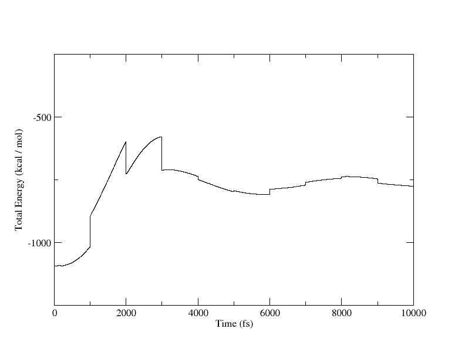

# Argon

## Background Information

Liquid Argon is the test case that is most widely used in molecular dynamics.  Typically we refer to these simulations in reduced units,
$$\rho^* = \rho \sigma^3  ~~~~~~  T^* = \frac{k_B T}{\epsilon}$$
where $\sigma$ and $\epsilon$ are the Lennard-Jones parameters representing the liquid. For Argon, $\sigma = 3.41$ angstroms, and $\epsilon = 0.2381$ kcal/mol.  

Typical state points for studying Argon might be at $T^* = 1.0$ (T = 119.8 K) or $T^* = 1.5$ (T = 178.5 K).

Here we show a couple of quick sample trajectories that explore a few state points:

## Instructions

### Example 1

This example runs a very small (108 atom) simulation in the canonical ensemble (constant-NVT).  The initial thermalizer command sets the initial velocities to sample a reduced temperature of 1 (T = 119.8):
```
thermalizer -t 119.8 argonNVT.omd -o warmNVT.omd
openmd warmNVT.omd
```

### Example 2

This is a somewhat larger box (500 atoms) run in the microcanonical ensemble (constant-NVE), and is a good test to make sure that energy is being conserved.  The second column of the generated `warm500.stat` file should be reasonably well conserved over the course of this simulation.
```
thermalizer -t 178.5 500.omd -o warm500.omd
openmd warm500.omd
```

### Example 3

This example is a larger box (864 atoms), and is set to resample velocities at T=135.1344K every 1 ps by setting three parameters: `targetTemp = 135.1344;`, `thermalTime = 1000.0;` and `tempSet = "true";`   This procedure helps rapidly equilibrate an initial structure to a fixed temperature when the initial structure is not particularly liquid-like.  In this example, we're running the simulation with four processors:
```
mpirun -np 4 openmd_MPI ar864.omd
```

## Expected Output

For the final simulation, we expect a report that looks like:
```
###############################################################################
# Status Report:                                                              #
#              Total Time:       10000 fs                                     #
#       Number of Samples:       10001                                        #
#            Total Energy:    -779.344  ±  2.18345      kcal/mol              #
#        Potential Energy:    -1127.47  ±  1.11893      kcal/mol              #
#          Kinetic Energy:     348.127  ±  1.21539      kcal/mol              #
#             Temperature:     135.329  ±  0.472464     K                     #
#                Pressure:     1012.95  ±  12.6328      atm                   #
#                  Volume:     40293.6  ±  0            A^3                   #
#      Conserved Quantity:    -1176.28  ±  1.67662      kcal/mol              #
###############################################################################
```
You can see the velocity resampling events if you plot the total energy of this last sample using the generated stat file.
```
xmgrace ar864.stat
```


