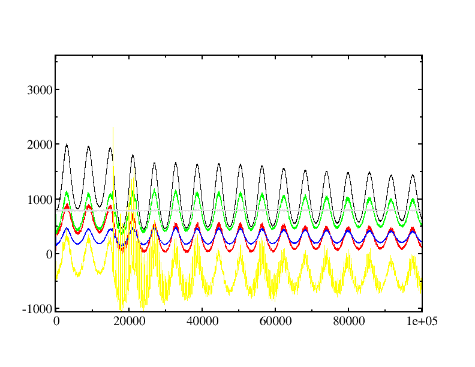

# Graphene

## Background Information

This sample illustrates a simulation of united-atom (UA) propylene
monomers confined between and all-atom (AA) representation of graphene
sheets.  The force field is based partially on OPLS-AA, and partially
on TraPPE-UA.

Propylene parameters are from: 

> C.D. Wick, M.G. Martin, and J.I. Siepmann, "Transferable potentials
> for phase equilibria. 4. United-atom description of linear and
> branched alkenes and of alkylbenzenes," *J. Phys. Chem. B*, **104**,
> pp. 8008-8016 (2000). DOI:
> [10.1021/jp001044x](https://doi.org/10.1021/jp001044x)

Note that the molecule definition in `graphene.inc` includes bonds that span the
box boundaries.  If you want to extend to larger boxes, start with the molecule
definition in `graphene.raw.inc` and then add bonds that span the boundaries of
the new box.

Files included:

1. `graphene.frc`: Force field file
2. `graphene.inc`: Molecule definition include file for a graphene
   sheet (includes cross-box bonding, so assumes a particular box
   geometry)
3. `graphene.raw.inc`: Molecule definition without the additional
   cross-box bonds. Contains unterminated sp<sup>2</sup> carbon atoms.
4. `graphene.omd`: initial OpenMD file for starting a simulation
5. `propylene.omd`: Molecule definition include file for the propylene monomers
6. `propylene.xyz`: A skeletal propylene xyz file for use with Packmol
7. `system.pack`: A [packmol](http://www.ime.unicamp.br/~martinez/packmol/)
   input script that places propylene molecules inside bounds of the
   graphene sheets.

## Instructions

### Example 1

To create the initial configurations, we typically run:

```bash
packmol < system.pack
```

which will create a `system.xyz` file containing all of the propylene moleucles.
To get this into a reasonable OpenMD starting configuration, we would run:

```bash
atom2omd -ixyz system.xyz
```

This creates `system.omd`, which has periodic box guessed from the bounding box
of the solvent molecules, and this box is generally **not** the same size as the
box containing the graphene sheets.  To successfully combine the monomers with
the graphene sheets, the `system.omd` file must be edited to modify the Hmat
line to read:

```
Hmat: {{ 22.23, 0, 0 }, { 0, 42.78, 0 }, { 0, 0, 50 }}
```

Then to combine the propylene monomers with the graphene sheets, eliminating
molecules that overlap, we would run:

```bash
omd-solvator -u graphene.omd -v system.omd -r 3.5 -o combined.omd -n 360 -p 3
```

Following this, we typically edit the `combined.omd` file to include the
molecule definitions, set the force field, and set various simulation
parameters:

```C++
#include "graphene.inc"
#include "propylene.omd"

component{
  type = graphene;
  nMol = 2;
}
component{
  type = propylene;
  nMol = 27;
}

forceField = "graphene";
ensemble = NVT;
cutoffMethod = "shifted_force";
electrostaticScreeningMethod = "damped";
cutoffRadius = 9;
dampingAlpha = 0.2;
targetTemp = 300;
tauThermostat = 1000;
dt = 1.0;
runTime = 1e5;
sampleTime = 1000;
statusTime = 10;
```

Once these modifications are in place, we can sample some initial velocities and run the simulation:

```bash
thermalizer -t 300 -i combined.omd -o warm.omd
mpirun -np 4 openmd_MPI combined.omd
```

### Example 2

Another way in which graphene sheets can be generated is with an external tool called [NPG-Builder](https://github.com/crdrisko/nd-grad/tree/main). This program outputs `.omd` and `.inc` files for a periodic graphene sheet with given box dimensions. Files created with this tool can be found in the `graphene/npg` directory, which contains a number of nanoporous graphene sheets with pore sizes from 0 (`graphene/npg/graphene.omd`) to 28 (`graphene/npg/p28/p28.omd`) rings disrupted.

## Expected Output

The report from this simulation should look similar to:

```
###############################################################################
# Status Report:                                                              #
#              Total Time:      100000 fs                                     #
#       Number of Samples:       10001                                        #
#            Total Energy:     1032.64  ±  7.80314      kcal/mol              #
#        Potential Energy:     316.363  ±  3.98448      kcal/mol              #
#          Kinetic Energy:     716.277  ±  4.27477      kcal/mol              #
#             Temperature:     300.369  ±  1.79261      K                     #
#                Pressure:    -355.884  ±  5.85146      atm                   #
#                  Volume:       47550  ±  7.7866e-06   A^3                   #
#      Conserved Quantity:      794.15  ±  0.111192     kcal/mol              #
###############################################################################
```

Visualizing the trajectory can be done by first converting to an `xyz`
file:
```bash
Dump2XYZ -i warm.dump -b -m
jmol warm.xyz
```
A useful command in jmol is:
- *Tools -> Animate... -> Once*

Note that the gaseous propylene between the graphene sheets exerts
enough pressure to drive them together at around 15500 fs (15.5 ps).
This is also evident if you plot the various thermodynamic quantities:

```bash
xmgrace -nxy warm.stat
```

Note the oscillations in many of these quantities which are due to the
presence of an external thermostat in the NVT simulation.  The
conserved quantity (grey in this plot), is relatively well maintained
during the simulation:


 
(Here we've zoomed in on some of the curves to show the collision event at 15.5 
ps and the oscillations in many of the thermodynamic
quantities.
