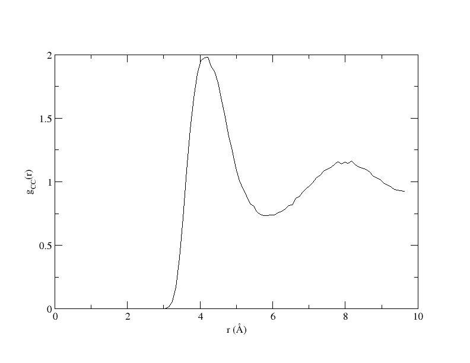
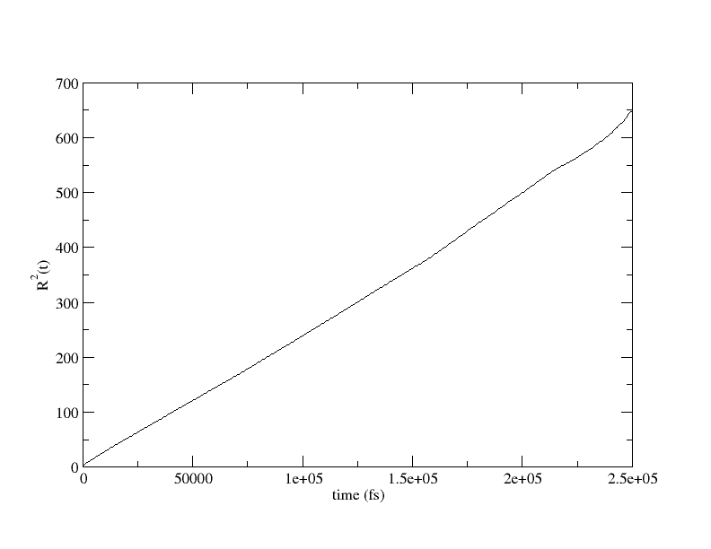

# Simple Liquid simulations using OpenMD

## Background Information
In this example, we’ll build a simulation of a simple liquid (methanol) starting with a structure file (in XYZ format). Getting your molecule of choice into OpenMD is never a black box procedure, and will almost always require some hand adjustment of the input files.

## Instructions

1. Start with a good structure for your molecule. We're going to be starting with the `methanol.xyz` structure that is in this directory.

2. Use the `atom2omd` program to convert the structure into a format that can be read by OpenMD:
    ```
    atom2omd -ixyz methanol.xyz
    ```
    This command will create an incomplete OpenMD file called `methanol.omd` that *must be edited* before it can be used.

3. OpenMD can use a number of force fields, but in this example, we’ll use the Amber force field. If you are using this force field and are starting from an XYZ file or non-standard PDB file, you *must edit the atom types*. In the `methanol.omd` file:
    - change the atom typing for the methyl carbon from `C3` to `CT`
    - change the `O3` to `OH`
    - The hydrogens on the carbon should also be changed from `HC` or `H` to `H1`
    - The hydroxyl hydrogen can be left alone.

4. At this point it is also a good idea to change the name of the molecule to something descriptive (perhaps "methanol"). This should be done in two places; once in the molecule description and another time in the component block.

5. Before the simulation can run, add a forceField line after the component block:
    ```
    forceField = "Amber";
    ```
    At this stage, you should be able to run OpenMD on the file to check to make sure your hand-crafted atom typing can be matched up with types known by the force field:
    ```
    openmd methanol.omd
    ```
    If there are any problems, correct any unknown atom types, and repeat until you get an error about the “Integrator Factory”.

6. Next, we’ll build a lattice of methanol molecules using this initial structure as a starting point. The density of liquid methanol is roughly 0.7918 g cm<sup>-3</sup>, so we’ll build a simple box of methanol molecules using the command:
    ```
    simpleBuilder -o liquid.omd --density=0.7918 --nx=3 --ny=3 --nz=3 methanol.omd
    ```
    This command creates a new system, `liquid.omd` which contains 108 copies of the methanol molecule arranged in a simple FCC lattice. FCC has 4 molecules in the unit cell, so the total number of molecules = 4 * 3 * 3 * 3 = 108. The molecules are packed at a distance commensurate with their liquid state density.

7. To visualize what the system looks like at this stage, you can run:
    ```
    Dump2XYZ -i liquid.omd -b
    ```
    to create a file called `liquid.xyz`. The -b flag prints out 'Base' atom types (i.e. the element name). This file can be viewed in VMD, Jmol, or any other chemical structure viewer.

8. Add the following lines below the forceField line of the `liquid.omd` file:
    ```
    ensemble = NVT;
    cutoffMethod = "shifted_force";
    electrostaticScreeningMethod = "damped";
    cutoffRadius = 9;
    dampingAlpha = 0.18;
    targetTemp = 300;
    tauThermostat = 1000;
    dt = 1.0;
    runTime = 1e3;
    tempSet = "false";
    sampleTime = 100;
    statusTime = 10;
    ```

9. Initial configurations that are created from bare structures typically have no velocity information. To give an initial kick to the atoms (i.e. to sample the velocities from a Maxwell-Boltzmann distribution), you can use the following command:
    ```
    thermalizer -o warm.omd -t 300 liquid.omd
    ```
    This creates a new OpenMD file called `warm.omd` which has initial velocity information.

10. At this stage, a simple simulation can be run:
    ```
    openmd warm.omd
    ```

11. This should complete relatively quickly, and should create a `warm.stat` file as well as a `warm.dump` file containing the actual trajectory.

12. To view the contents of the trajectory file, you’ll need to convert the dump file into something another program can visualize:
    ```
    Dump2XYZ -i warm.dump -m -b
    ```
    will create a new file `warm.xyz` that can be viewed in VMD and many other chemical structure viewers.  The -m flag maps molecules that leave the periodic box back into the box.

13. The “End-of-Run” file warm.eor can be re-purposed as the starting point for a new simulation:
    ```
    cp warm.eor stable.omd
    ```

14. Edit the `stable.omd` file, and change the following parameters before running openmd on the new file:
    ```
    tauThermostat = 100;
    runTime = 1.5e4;
    sampleTime = 1000;
    ```
    then run,
    ```
    openmd stable.omd
    ```

15. Copy the endpoint of the stabilization run into the starting point for an equilibration run:
    ```
    cp stable.eor equil.omd
    ```

16. Edit equil.omd, and change the following lines:
    ```
    ensemble = NVE;
    runTime = 2.5e4;
    ```
    and run the command
    ```
    openmd equil.omd
    ```

17. Copy the endpoint of the equilibration run into the starting point for a collection run:
    ```
    cp equil.eor collection.omd
    ```

18. Edit collection.omd, and change the following lines:
    ```
    runTime = 2.5e5;
    sampleTime = 500;
    ```
    and run the command
    ```
    openmd collection.omd
    ```

## Expected Output

We'll analyze the results of the simulation with two `OpenMD` tools, `StaticProps` for structural features and `DynamicProps` for dynamic properties.

First we can analyze the trajectory (dump) file to make a carbon-carbon pair correlation function, gCC(r) with the following command:
```
StaticProps -i collection.dump -g --sele1="select CT" --sele2="select CT"
```
and view the result with
```
xmgrace collection.gofr
```



The g(r) analysis we performed gives us structural information about the system; to work with dynamics, such as computing the mean squared displacement as a function of time, we can use the following:
```
DynamicProps -i collection.dump -r --sele1="select methanol"
```
View the R<sup>2</sup>(t) function with
```
xmgrace collection.rcorr
```


