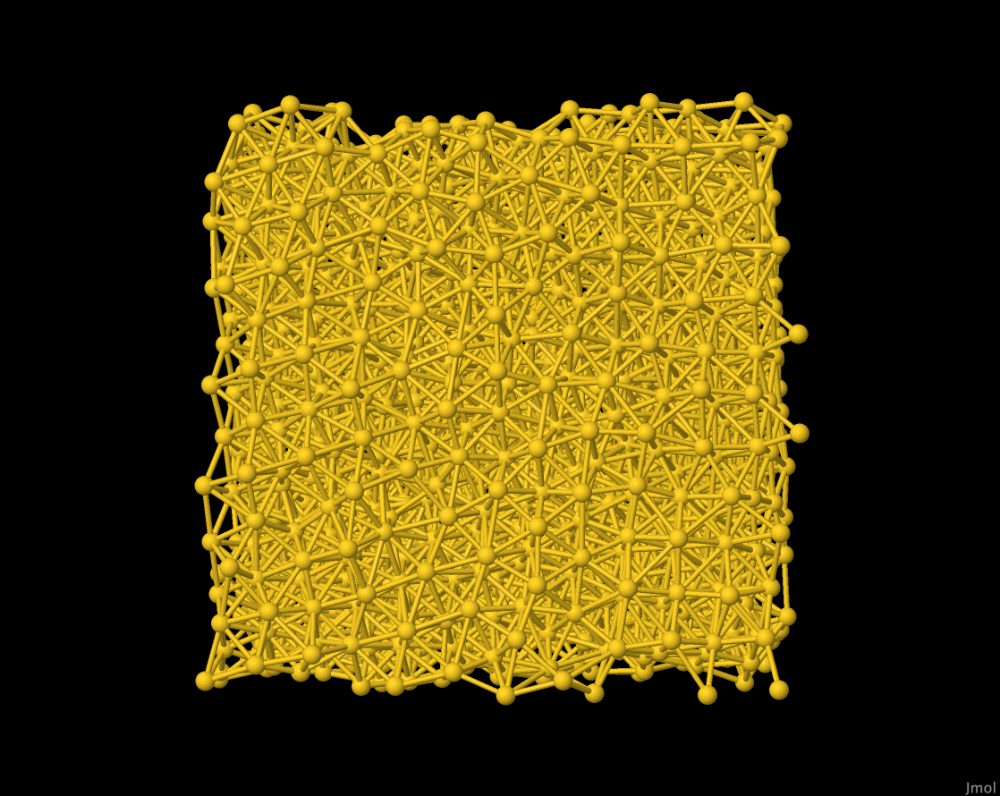

# Simulations using the Embedded Atom Method (EAM)
 
The EAM force field illustrates an additional feature of
OpenMD in the use of *force field variants*.  Some background:
Foiles, Baskes and Daw fit embedded atom method (EAM) potentials 
for Cu, Ag, Au, Ni, Pd, Pt and  alloys of these metals. These fits are 
included in OpenMD as the `u3` variant of the EAM force field.  

> S. M. Foiles, M. I. Baskes, and M. S. Daw. Embedded-atom-method functions for the fcc metals Cu, Ag, Au, Ni, Pd, Pt, and their alloys. *Phys. Rev. B*, **33**(12):7983, 1986

Voter and Chen reparamaterized a set of EAM functions
which do a better job of predicting melting points:

> A.F. Voter and S.P. Chen. Accurate interatomic potentials for Ni, Al, and Ni<sub>3</sub>Al. *Mat. Res. Soc. Symp. Proc.*, **82**:175, 1987.

These functions are included in OpenMD as the `VC` variant of
the EAM force field.  An additional set of functions (the
*Universal 6* functions) are included in OpenMD as the `u6`
variant of EAM. 

To specify the Voter-Chen variant
of the EAM force field, the user would add the 
```
forceFieldVariant = "VC";
```
line to the `<MetaData>` block in the `omd` file.

The potential files used by some fo the EAM force field variants 
are in standard `funcfl` format, which is the also utilized by
a number of other codes.  It should be noted that the energy 
units in these files are in eV.

OpenMD also implements parameterized versions of the density,
embedding functional, and pair potentials that were developed by Zhou, *et al.*

For the `Zhou2001` variant:
> X.W. Zhou, H.N.G. Wadley, R.A. Johnson, D.J. Larson, N. Tabat,
> A. Cerezo, A.K. Petford-Long, G.D.W. Smith, P.H. Clifton,
> R.L. Martens, T.F. Kelly, "Atomic scale structure of sputtered
> metal multilayers," *Acta Materialia* **49**(19), pp. 4005-4015 (2001).
> http://dx.doi.org/10.1016/S1359-6454(01)00287-7

and

> H.N.G Wadley, X Zhou, R.A Johnson, M Neurock, "Mechanisms,
> Models and methods of vapor deposition," *Progress in Materials
> Science* **46**(3–4), pp. 329-377 (2001).
> http://dx.doi.org/10.1016/S0079-6425(00)00009-8

For the `Zhou2004` variant:
> X. W. Zhou, R. A. Johnson, and H. N. G. Wadley, *Phys. Rev. B*, **69**, 144113 (2004).

And for the `Zhou2005 variant:
> X. W. Zhou and H. N. G. Wadley, *J. Phys. Cond. Matter.* **17** (2005) 3619-3635

Users interested in the details of specifying force fields for metals, should look into the forceFields directory of the `OpenMD` installation. 

## Background Information

The three sample files in this directory describe nearly identical short (4 ps) simulations of bulk gold at a temperature of approximately 450K. The systems have some internal structural disorder, but are still well below the melting point. All starting atomic coordinates and velocities are the same, but they describe simulations using different variants of the EAM force field. 

## Instructions

To run the samples, we would do the following commands:
```bash
openmd Au_bulk_FBD.omd   # simulate using Foiles, Baskes, Daw (u3) variant
openmd Au_bulk_voter.omd # simulate using Voter-Chen variant
openmd Au_bulk_Zhou.omd  # simulate using the parameterized Zhou2004 variant
```
## Expected Output

For the `u3` (FBD) variant, we expect the following report at the end of the short simulation:
```
###############################################################################
# Status Report:                                                              #
#              Total Time:        4000 fs                                     #
#       Number of Samples:        1001                                        #
#            Total Energy:     -118581  ±  0.00252905   kcal/mol              #
#        Potential Energy:     -120407  ±  2.22438      kcal/mol              #
#          Kinetic Energy:     1826.25  ±  2.22269      kcal/mol              #
#             Temperature:     446.875  ±  0.543881     K                     #
#                Pressure:    -10747.5  ±  31.6681      atm                   #
#                  Volume:     24221.9  ±  0            A^3                   #
#      Conserved Quantity:     -118581  ±  0.00252905   kcal/mol              #
###############################################################################
```

For the Voter variant, we expect a very similar report, 
```
###############################################################################
# Status Report:                                                              #
#              Total Time:        4000 fs                                     #
#       Number of Samples:        1001                                        #
#            Total Energy:     -118438  ±  0.00248719   kcal/mol              #
#        Potential Energy:     -120327  ±  1.64571      kcal/mol              #
#          Kinetic Energy:     1888.63  ±  1.64416      kcal/mol              #
#             Temperature:     462.139  ±  0.402319     K                     #
#                Pressure:     2027.17  ±  25.2776      atm                   #
#                  Volume:     24221.9  ±  0            A^3                   #
#      Conserved Quantity:     -118438  ±  0.00248719   kcal/mol              #
###############################################################################
```
And for the Zhou2004 variant we expect these thermodynamic means:
```
###############################################################################
# Status Report:                                                              #
#              Total Time:        4000 fs                                     #
#       Number of Samples:        1001                                        #
#            Total Energy:     -118584  ±  0.0139345    kcal/mol              #
#        Potential Energy:     -120523  ±  1.82105      kcal/mol              #
#          Kinetic Energy:      1939.1  ±  1.81879      kcal/mol              #
#             Temperature:     474.489  ±  0.44505      K                     #
#                Pressure:     7623.09  ±  26.2598      atm                   #
#                  Volume:     24221.9  ±  0            A^3                   #
#      Conserved Quantity:     -118584  ±  0.0139345    kcal/mol              #
###############################################################################
```

To visualize the movies of these files, one would use `Dump2XYZ`:
```
Dump2XYZ -i Au_bulk_FBD.dump -b -m
Dump2XYZ -i Au_bulk_voter.dump -b -m
Dump2XYZ -i Au_bulk_Zhou.dump -b -m
```
and then visualize the resulting `xyz` file using `jmol`:
```
jmol Au_bulk_FBD.xyz
jmol Au_bulk_voter.xyz
jmol Au_bulk_Zhou.xyz
```
 
Typical end-points of the trajectories look like:

