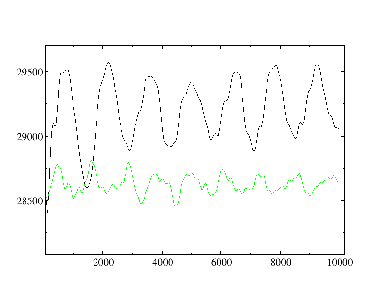

# Nanoparticle simulations using the Embedded Atom Method (EAM)

## Background Information

The two sample files in this directory describe metallic simulations of 
nanoparticles, carried out without periodic boundary conditions. The key parameter
to enable this,

```C++
usePeriodicBoundaryConditions = "false";
```

is present in both of these samples.  The samples were created by the `nanoparticleBuilder` utility.  More details on this are given in the `builders` sample directory.

 - `Au-core-Ag-shell.omd` - a 12.5 Å radius gold core surrounded by a 20 Å radius silver shell, with velocities sampled from a 250K Maxwell-Boltzmann distribution
 - `Au_nanoparticle.omd` - a 20 Å radius gold nanoparticle, with velocities sampled from a 850K distribution.

The samples are initiated at different temperatures to showcase different analyisis methods as well as the size-dependence of the melting point.  Small nanoparticles have a lower melting point than the bulk metal, and this 20 Å gold particle is being simulated very close to its melting point. These are relatively short (10 ps) simulations, and a deeper analysis would require significantly longer sampling.

## Instructions

To run the samples, we would do the following commands (assuming we have build the MPI-aware version of OpenMD):
```bash
mpirun -np 4 openmd_MPI Au-Core-Ag-Shell_Nanoparticle.omd 
mpirun -np 4 openmd_MPI Au_nanoparticle.omd
```

To visualize these trajectories, we can convert the `dump` file into xyz:
```bash
Dump2XYZ -i Au-Core-Ag-Shell_Nanoparticle.dump -b
Dump2XYZ -i Au_nanoparticle.dump -b
```
Note that we have *not* used the `-m` flag which maps back to periodic boundaries, as they are not being used in these simulations.

These xyz files can be visualized with either jmol or VMD to get a feel for the melting / vibrational dynamics at the different temperatures.

To analyze the surface area and volume of the nanoparticles during the simulation, we can use the `--hullvol` calculator in `StaticProps`:

```bash
StaticProps -i Au-Core-Ag-Shell_Nanoparticle.dump --hullvol
StaticProps -i Au_nanoparticle.dump --hullvol
```

## Expected Output

The `--hullvol` calculator prints out the volume and surface area of the nanoparticles for each configuration in the `dump` file.  This data is placed in an `avol` file, and we can plot these quantities for both samples:

```bash
xmgrace -nxy Au_nanoparticle.avol -nxy Au-Core-Ag-Shell_Nanoparticle.avol
```

Zooming in on the volumes of the two particles, we can see that they start at nearly identical volumes. The breathing vibration of the lower temperature core-shell particle (the black curve) is quite clear, but there is much less structure in the higher tmeperture Gold particle that has partially melted (the green curve):



