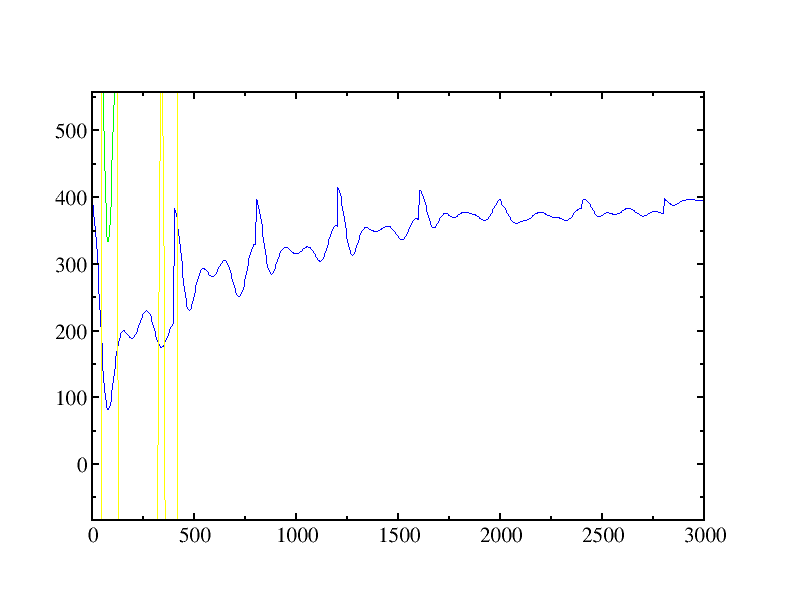

# Simulations using the Sutton-Chen potential
 
The Sutton-Chen (SC) potential has been used to
study a wide range of phenomena in metals: 

> A. P. Sutton and J. Chen. Long-range Finnis Sinclair potentials. *Phil. Mag. Lett.*, **61**:139–146, 1990.
 
Although it has the same basic form as the EAM potential, 
the Sutton-Chen model requires a simpler set of parameters,

$$
U_\textrm{tot}=\sum_{i}\left[\frac{1}{2} \sum_{j \neq i} \epsilon_{ij} V_{ij}^\textrm{pair}(r_{ij}) - c_{i} \epsilon_{ii} \sqrt{\rho_{i}} \right]
$$

where $V_{ij}^\text{pair}$ and $\rho_{i}$ are given by 

$$
V_{ij}^\text{pair}(r)=\left(
\frac{\alpha_{ij}}{r_{ij}}\right)^{n_{ij}} ~~~~~~~~~~~~~ \rho_{i}=\sum_{j\neq i}\left(
\frac{\alpha_{ij}}{r_{ij}}\right) ^{m_{ij}}
$$

$V_{ij}^{pair}$ is a repulsive pairwise potential that accounts for
interactions of the pseudo-atom cores.  The $\sqrt{\rho_{i}}$ term in
the first equation is an attractive many-body potential that models
the interactions between the valence electrons and the cores of the
pseudo-atoms.  $\epsilon_{ij}$, $\epsilon_{ii}$, $c_i$ and
$\alpha_{ij}$ are parameters used to tune the potential for different
transition metals.

The SC potential form has also been parameterized by Qi, *et
al.*:

> Y. Qi, T. &Ccedil;aǧin, Y. Kimura, and W. A. Goddard III. Molecular dynamics simulations of glass formation and crystallization in binary liquid metals: Cu-Ag and Cu-Ni. *Phys. Rev. B*, **59**(5):3527–3533, 1999.

These parameters were obtained via empirical and *ab initio* 
calculations to match structural features of the FCC crystal.  This variant is called the `QSC` variant in `OpenMD` 

## Background Information

The two sample files in this directory describe identical short (3 ps) simulations of bulk gold in a FCC crystal.  The only differences are in the force field variants, but in this example, we are using the file name of the force field to select the variant:

```C++
forceFieldFileName = "SuttonChen.QSC.frc";
```
for the QSC sample and 
```C++
forceFieldFileName = "SuttonChen.frc";
```
for the original Sutton-Chen parameters. These samples also illustrate another feature, periodic thermalization of the atomic velocitites. The initial atomic velocities in these samples are all 0, so to provide kinetic energy, we add these lines to the `<MetaData>` section:

```
targetTemp = 400.0;
thermalTime = 400;
seed = 985456376;
tempSet="true";
```
These four parameters, set a target temperature of 400K, tell `OpenMD` to resample velocities (and to do so every 400 fs) and to use a random seed so that the process is reproducible.

## Instructions

To run the samples, we would do the following commands:
```bash
openmd Au_bulk_SC.omd   # simulate using original Sutton-Chen parameters
openmd Au_bulk_QSC.omd  # simulate using the Quantum Sutton-Chen parameters
```

Another utility built in to `OpenMD` can be used to look at the elastic constants of gold:

```bash
elasticConstants -i Au_bulk_QSC.omd -b --method="energy"
```

## Expected Output

Here, we're going to look at the stat file which shows the effect of the periodic thermalization that were turned on during these simulations:

```bash
xmgrace -nxy Au_bulk_QSC.stat
```
Zooming in on the temperature (blue) line, we can see that every 400 fs, the simulation has resampled velocities to match the target temperature:



This is a good way to quickly prepare a sample and bring it up to a desired temperature. Note that the `tempSet = "true";` parameter should be set back to `tempSet = "false";` before any sampling of configurations is done.  Periodic velocity sampling is a relatively severe perturbation on the normal motion.


For the elastic constant calculations, the expected output for this file shows the full elastic and compliance tensors, but also computes various moduli (Bulk, Shear, Young's, and Poisson's ratio) for the sample:
```
Doing box optimization

Original Box Geometry (Angstroms):

      28.5445            0            0 
            0      28.5445            0 
            0            0      28.5445 

Optimized Box Geometry (Angstroms):

      28.4179 -1.37164e-18 -2.98806e-19 
 -1.37164e-18      28.4179 -2.10653e-18 
 -2.98806e-19 -2.10653e-18      28.4179 

Elastic Tensor (GPa):

      215.161      177.552      177.552     0.275839       11.071       11.071
      177.552      215.161      177.552       11.071     0.275839       11.071
      177.552      177.552      215.161       11.071       11.071     0.275839
     0.275839       11.071       11.071      67.1283      1.07045      1.07045
       11.071     0.275839       11.071      1.07045      67.1283      1.07045
       11.071       11.071     0.275839      1.07045      1.07045      67.1283

Compliance Tensor (GPa^-1):

     0.019191  -0.00870741  -0.00870741   0.00284782  -0.00171133  -0.00171133
  -0.00870741     0.019191  -0.00870741  -0.00171133   0.00284782  -0.00171133
  -0.00870741  -0.00870741     0.019191  -0.00171133  -0.00171133   0.00284782
   0.00284782  -0.00171133  -0.00171133     0.015463 -0.000420278 -0.000420278
  -0.00171133   0.00284782  -0.00171133 -0.000420278     0.015463 -0.000420278
  -0.00171133  -0.00171133   0.00284782 -0.000420278 -0.000420278     0.015463

                                     Voigt        Reuss        Hill
Bulk modulus:                      190.089       187.67      188.879 (GPa)
Shear modulus:                     47.7987       31.649      39.7239 (GPa)
Young's modulus (isotropic):       132.306      89.8938      111.364 (GPa)
Poisson's Ratio:                  0.383996     0.420167     0.401732
Universal elastic Anisotropy:      2.56425
```
