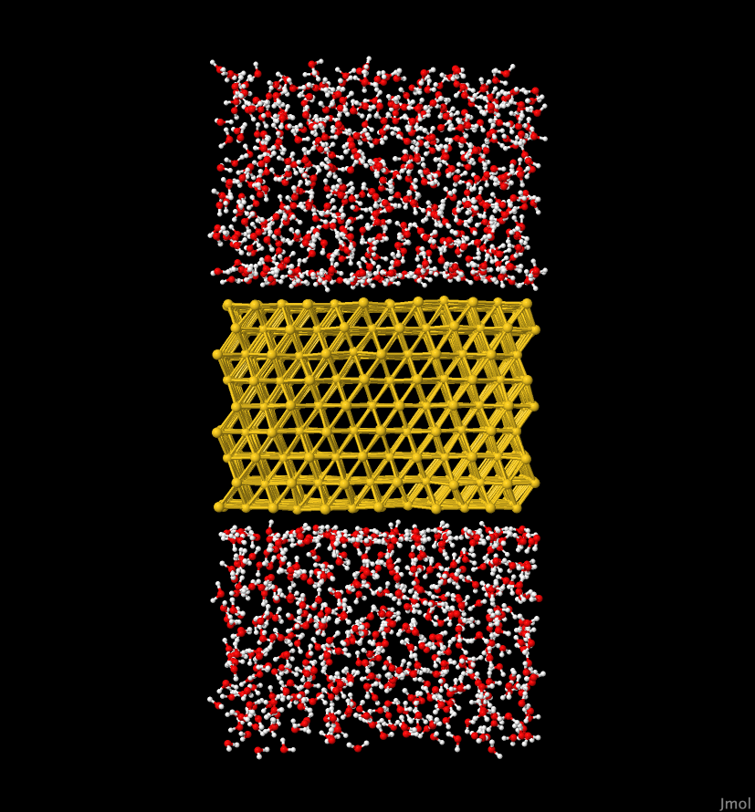
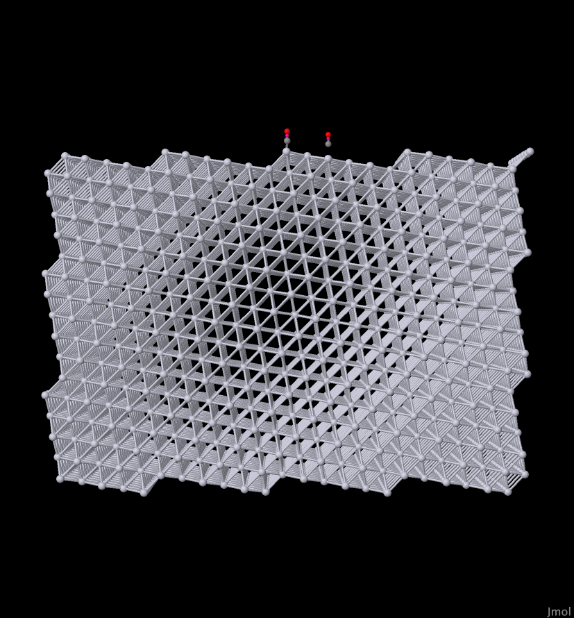
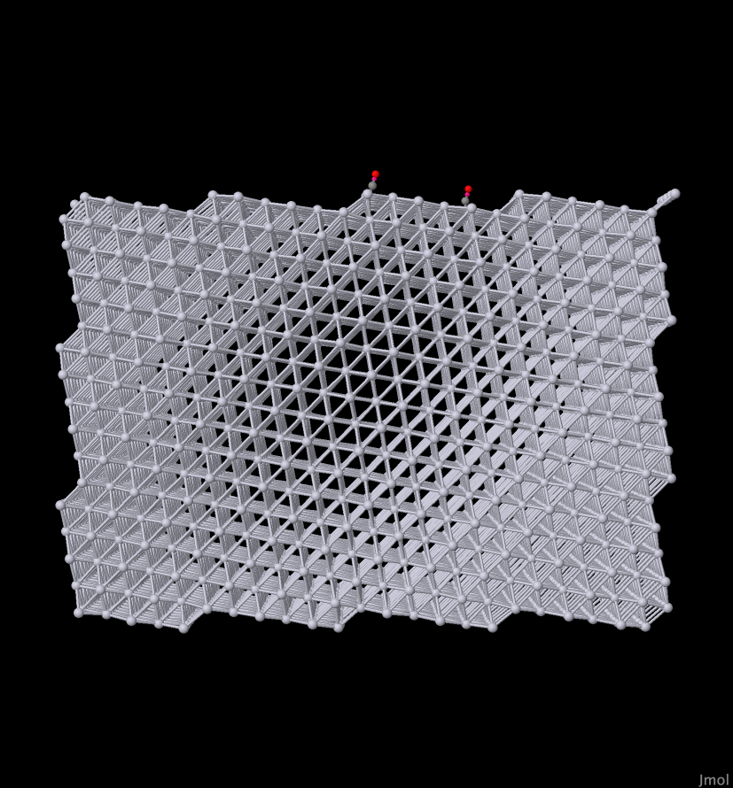

# Metals

## Background Information

One common task done with OpenMD is the simulation of metallic 
surfaces. Here, we show how to create and simulate particular facets
of FCC metals, sometimes in contact with liquids or other molecules.

### slabBuilder

OpenMD has a utility script which makes creation of these types
of systems relatively easy. `slabBuilder` is a python script which 
generates *sc*, *bcc*, and *fcc* lattices and cleaves the crystals along a
desired *(hkl)* plane. The systems are then reoriented such that the
cleaved facet is presented to the z-dimension of the simulation
box. `slabBuilder` comes with a help message when passed `-h` or
`--help`.

### waterBoxer and omd-solvator

Another helpful utility called `waterBoxer` creates initial coordinates 
of water boxes.  In what follows we're going to create a metal interface
and a matching box of water, and then we'll combine them together using
`omd-solvator`

## Instructions 

### Example 1: Au(111) - Water Interface

Let's first build a gold slab with the 111 facet facing the 
*z*-direction, and with some vaccuum space above and below the slab.
Gold forms fcc lattices, and the lattice constant is 4.08 
angstroms. We'll specify the facet with the `--hkl` flag, and how many 
unit cell repeats we want with the `-r` flag.  This command creates an 
output `omd` file and also puts the coordinates in a matching `xyz` file:

```bash
slabBuilder -l fcc -c 4.08 -o gold111.omd --hkl 1 1 1 -r 3 4 3 -e Au -v true -x gold111.xyz
```
The `slabBuilder` command prints out the dimensions of the slab it created, but the size of the periodic box is also given on the `Hmat` line in the generated `gold111.omd` file:
```
Hmat: {{ 29.981754, 0.000000, 0.000000 }, { 0.000000, 23.079965, 0.000000 }, { 0.000000, 0.000000, 63.600906 }}
```

Next, we want to generate a box of water that is exactly the same size as the gold slab:
```
waterBoxer -d 1.0 -w SPCE -x 29.981754 -y 23.079965 -z 63.600906 -r -m
Dump2XYZ -i freshWater.omd -b 
```
This creates a file called `freshWater.omd` which has dimensions that 
exactly match the gold slab, and the second command allows us to 
visualize these coordinates in the `freshWater.xyz` using Jmol or VMD. 
Here we've randomized the orientations of the water molecules (`-r`) and 
have printed a `water.inc` include file (`-m`)

The next step is to combine the two files together to create a metal - water interface in a `combined.omd` file.

```
omd-solvator --solute=gold111.omd --solvent=freshWater.omd -r 3.5 -o combined.omd -n 1 -p 1
```
We can't run this file yet because force field and molecular definitions need to be added.  Edit the `combined.omd` file so that the `<MetaData>` section near the top looks like this:
```C++
   <MetaData>
#include 'metals.inc'  // includes the molecule definitions for metals
#include 'water.inc'   // includes the molecule definitions for water models

component{
  type = "Au";
  nMol = 864;          // should be unchanged
}
component{
  type = "SPCE"; 
nMol = 1020;           // should be unchanged
}

forceField = "MnM";    // looks for 'MnM.frc' in this directory
dt = 1.0;
runTime = 10000;
statusTime = 1;
sampleTime = 100;
ensemble = NVT;
targetTemp = 300;
tauThermostat = 300;
cutoffRadius = 12;
dampingAlpha = 0.185;
cutoffMethod = "shifted_force";
    </MetaData>
```
The component blocks should be unchanged from what came out of `omd-solvator`, but we need to specify a force field `MnM.frc` and other parameters before we can simulate this system.

Running this simulation takes a bit of time (15-30 minutes on four reasonably fast cores) so we'll use the parallel version of OpenMD:

```bash
mpirun -np 4 openmd_MPI combined.omd
```

At the end of this, we'll generally want to look at a movie of the simulation:
```bash
Dump2XYZ -i combined.dump -m -b
```

### Example 2: Pt(557) - with adsorbed Carbon Monoxide

Let's first build a Platinum slab with the 557 facet facing the 
*z*-direction, and with some vaccuum space above and below the slab.
Platinum also forms fcc lattices, and the lattice constant is 3.9242 
angstroms. We'll specify the facet with the `--hkl` flag, and how many 
unit cell repeats we want with the `-r` flag.  This command creates an 
output `omd` file and also puts the coordinates in a matching `xyz` file:

```bash
slabBuilder -l fcc -c 3.9242 -o pt557.omd --hkl 5 5 7 -r 1 4 1 -e Pt -v true -x pt557.xyz
```
This creates a box that is quite large:
```
Hmat: {{ 55.218389, 0.000000, 0.000000 }, { 0.000000, 22.198627, 0.000000 }, { 0.000000, 0.000000, 117.135891 }}
```

We'll need to modify the `pt557.omd` file to add a few CO molecules. This 
time, we'll do a bit of this by hand.  We'll be using a rigid 3-site model 
that was developed by Straub and Karplus, and the molecule definition is 
provided in the `CO.inc` file:
```C++
molecule{
  name = "CarbonMonoxide";
  atom[0]{
    type = "CO";
    position(0.0, 0.0, 0.0);
  }
  atom[1]{
    type = "OC";
    position(0.0, 0.0, 1.13);
  }
  atom[2]{
    type = "M_CO";
    position(0.0, 0.0, 0.6457);
  }
  rigidBody[0]{
    members(0,1,2);
  }
}
```
The atom types `CO`, `OC`, and `M_CO` are all specified in the `MnM.frc` 
file in this directory. Note that this molecule definition is a rigid body, 
which means that each molecule needs only one set of coordinates (and 
quaternions) to define its position and orientation.  We're going to place 
two CO molecules near the middle of the box in *x* and *y*, but just above 
one of the 557 facets.  Here's how we do it:

1. Edit the `pt557.omd` file and make sure we have included the `CO.inc` file. 
The top few lines of `pt557.omd` should look like this:
    ```C++
    <OpenMD version=2>
      <MetaData> 

    #include "CO.inc"

    molecule{
      name = "Pt";

      atom[0]{
        type="Pt";
        position( 0.0, 0.0, 0.0 );
      }
    }
    ```

2. Next, add a component block for two CO molecules. The component blocks
should then look like:
    ```C++
    component{
      type = "Pt";
      nMol = 3168;
    }

    component{
      type = "CarbonMonoxide";
      nMol = 2;
    }
    ```

3. Then at the very bottom of the file, we'll need to add lines to specify 
the positions and orientations of the CO molecules.  We'll put them near 
the center of the box, at about 22 angstroms in *z*.  When we're done the 
bottom of the `pt557.omd` file should look like:
    ```
            3167    pv      -22.937942      9.018192        18.536656       0.0     0.0     0.0
            3168    pq   0 0 22 0 0 0 1
            3169    pq   5 5 22 0 0 0 1
        </StuntDoubles> 
      </Snapshot>
    </OpenMD>
    ```
    The `pq` field tells OpenMD that the data that follows is a position (x, y, z) 
    and quaternions (qw, qx, qy, qz).

4. We can visualize what this structure looks like prior to simulation:
    ```bash
    Dump2XYZ -i pt557.omd -b -m
    jmol pt557.xyz
    ```

5. Next, we'll provide some initial velocities to all of the atoms
    ```bash
    thermalizer -t 300 -i pt557.omd -o pt557_warm.omd
    ```

6. And finally, let's run the simulation and visualize the results:
    ``` bash
    mpirun -np 4 openmd_MPI pt557_warm.omd
    Dump2XYZ -i pt557_warm.eor -b -m
    ```

## Expected Output

### Example 1

The final configuration from the combined metal / water simulation should 
look like this when viewed from the side:



### Example 2

Here we show the side views of the initial Pt (557) interface with two CO 
molecules positioned near the surface, and then after the relatively 
short (10 ps) simulation with them bound on one of the steps:

<p float="left">
  
  
</p>
