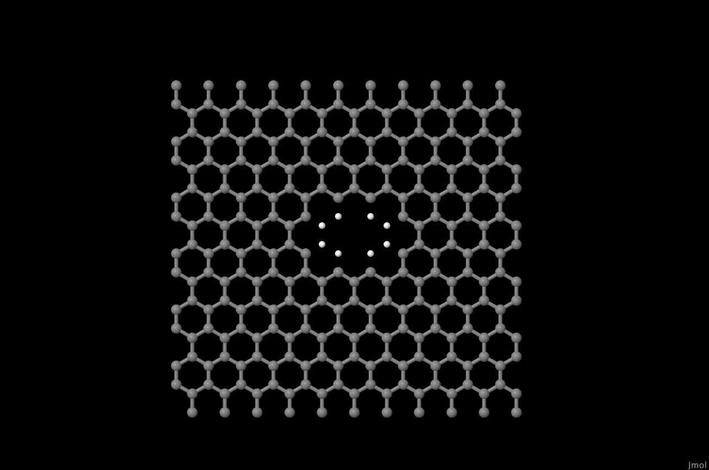
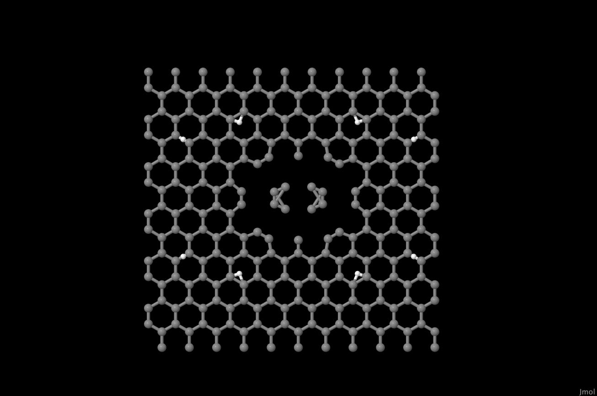
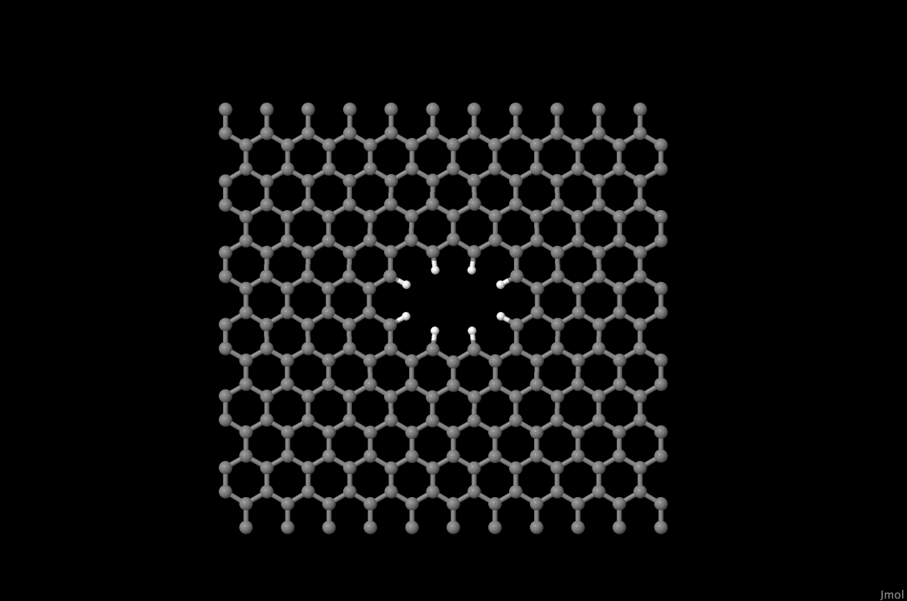
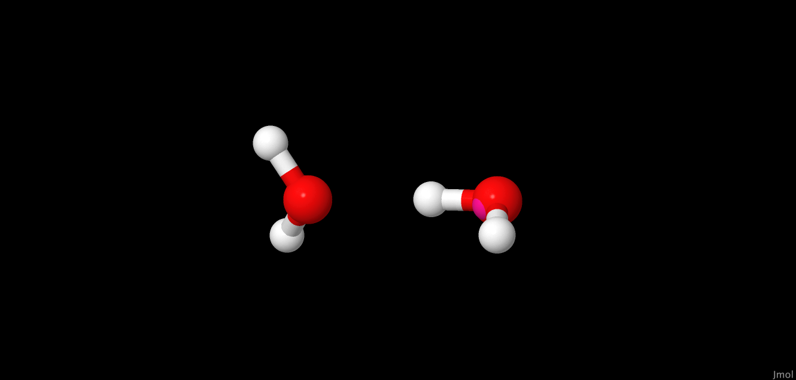

# Minimizer

## Background Information

Energy minimization is used to identify local configurations that are stable points on the potential energy surface. There is a vast literature on energy minimization algorithms have been developed to search for the global energy minimum as well as to find local structures which are stable fixed points on the surface. We have included two simple minimization algorithms: steepest descent, (SD) and conjugate gradient (CG) to help users find reasonable local minima from their initial configurations. Since OpenMD handles atoms and rigid bodies which have orientational coordinates as well as translational coordinates, there is some subtlety to the choice of parameters for minimization algorithms.

## Instructions

### Example 1

Energy mimimization can be an important step in setting up your simulations with OpenMD. In this example we'll look at performing an energy minimization on two Tip4P water molecules using `OpenMD`. 

Within `OpenMD`, all mimimization parameters are defined in the minimization block:
```C++
minimizer {
  useMinimizer = true;
  // ...
}
```

For our Tip4P example, we'll be using the `tip4p_two.omd` file. Since the mimimizer block has already been added all we need to do is run `OpenMD`:
```
openmd tip4p_two.omd
```

One thing to note with the mimizer code is that the ensemble must be removed (or commented out) before it runs. That won't happen with this example but is a common mistake when swapping between using `OpenMD` for molecular dynamics and energy minimization.

### Example 2

Our next example is a little more interesting. We start with a small nanoporous graphene sheet constructed using the external tool [NPG-Builder](https://github.com/crdrisko/nd-grad/tree/main). NPG-Builder creates an omd input file with all atom locations placed on a kind of hexagonal grid, with no regard for atom type. As we can see from the `graphene.frc` file, bond distances vary based on the involved atoms:
```
CA	HA	Harmonic	1.080	...
CB	CB	Harmonic	1.370	...
CA	CB	Harmonic	1.404	...
CA	CA	Harmonic	1.40	...
```

We can use `OpenMD`'s minimizer to convert the unrealistic input structure to something more reasonable. Since the creator of NPG-Builder (me) envisioned this interaction with OpenMD, the minimizer block is already included in the output NPG file:
```C++
minimizer {
  useMinimizer = true;
  method = "SD";
}

forceField = "graphene";
// ensemble = NVT;
```

For our example here, the file `p10-small.omd` contains an output file from NPG-Builder for a 25 &#8491; x 25 &#8491; graphene sheet with a small pore in the center. All that's left for us is to run the code:
```bash
openmd p10-small.omd
```

## Expected Output

Let's take a look at the output of our minimizations in jmol by running the following commands:
```bash
Dump2XYZ -m -b -i p10-small.dump 
jmol p10-small.xyz    ### To run the animation: Tools -> Animate... -> Once
```

Animate the frames with the comment above and watch some of the crazy configurations it tries before finally settling into the minimized structure. Below are some screenshots from the beginning, middle, and end of the minimization procedure:
<p float="left">
  
  
  
</p>

We can do the same with the two water molecule simulation, 

```bash
Dump2XYZ -m -b -i tip4p_two.dump 
jmol tip4p_two.xyz    ### To run the animation: Tools -> Animate... -> Once
```

Watching the minimization procedure here looks a lot like an elastic collision between the two water molecules, but ultimately settles on the following structure:


