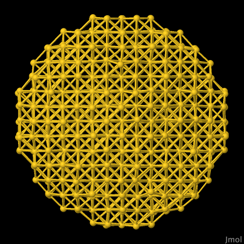
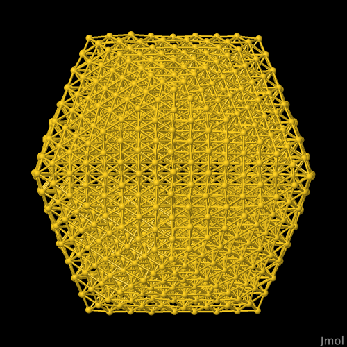
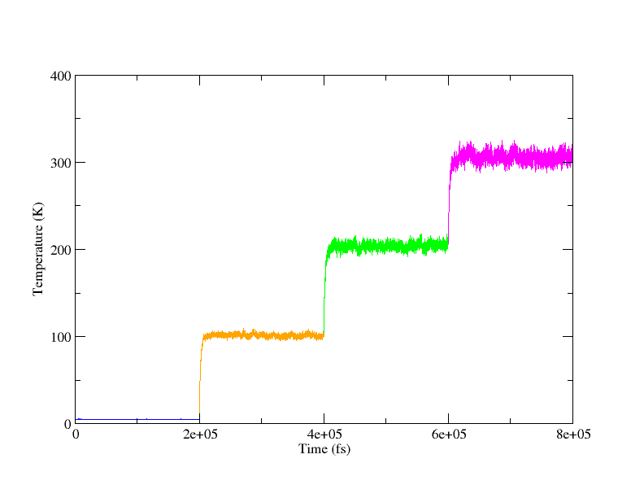

# Metallic nanoparticles

## Background Information

In these examples, we’ll build gold nanoparticles and equilibrate them to a temperature of 300K.

## Instructions

### Example 1

Here we'll look at building a spherical metal nanoparticle:

1. We need to start with an input `.omd` file for the metal of your choice. This directory has a `gold.omd` for this example. It looks like:
    ```C++
    <OpenMD>
      <MetaData>
    molecule{
      name = "Au";

      atom[0]{
        type = "Au";
        position(0.0, 0.0, 0.0);
      }
    }

    component{
      type = "Au";
      nMol = 1;
    }

    forceField = "SC";
    forceFieldFileName = "SuttonChen.QSC.frc";
      </MetaData>
    </OpenMD>
    ```

2. Now to build the nanoparticle. We’ll choose a radius of 15 Å and use the lattice constant of gold, 4.08 Å. We’ll call our initial structure `NP15.omd`.
    ```bash
    nanoparticleBuilder --latticeConstant=4.08 --radius=15 gold.omd -o NP15.omd
    ```

3. To take a look at the structure we’ve just created, you can use the following command:
    ```bash
    Dump2XYZ -i NP15.omd
    ```
    to create a file called `NP15.xyz`, which can be viewed in VMD, Jmol, or any other chemical structure viewer.

4. Add the following lines to the new NP15.omd file below the `forceFieldFileName` line. This sets some details for the simulation.
    ```C++
    ensemble = "LHull";
    targetTemp = 5;
    targetPressure = 1;
    viscosity = 0.1;
    dt = 4.0;
    runTime = 2E5;

    sampleTime = 2000.0;
    statusTime = 4;
    seed = 985456376;

    usePeriodicBoundaryConditions = "false";
    tauThermostat = 1E3;
    tauBarostat = 5E3;
    ```

5. NanoparticleBuilder carves a nanoparticle of our chosen radius out of a perfect gold crystal. We need to give the atoms some initial velocities before we start equilibrating. We’ll start it out at 5K:
    ```bash
    thermalizer -t 5 NP15.omd -o NP15_5K.omd
    ```

6. For the first step in the equilibration we need to let the gold lattice structurally relax. `NP15_5K.omd` can now be run:
    ```bash
    openmd NP15_5K.omd
    ```

7. Running the simulation will create several new files. `NP15_5K.dump` contains the trajectory of the simulation. Statistics such as temperature, pressure, and energy will be recorded in the `NP15_5K.stat` file and can be viewed using:
    ```bash
    xmgrace -nxy NP15_5K.stat
    ```

8. The end-of-run file `NP15_5K.eor` stores the last configuration of the simulation. We’ll copy it to a new .omd file.
    ```bash
    cp NP15_5K.eor NP15_100K.omd
    ```

9. To continue with the equilibration we need to change the `targetTemp` of `NP15_100K.omd`. We’ll increase it to 100 and run the `NP15_100K.omd` file.

10. We’ll continue the procedure of copying the .eor file to a new .omd file and increasing the temperature until we’ve reached 300K. Temperature increases of 50 – 100K and simulation times of 100 – 200 ps are reasonable.

### Example 2

In this example, we'll be building an icosahedral metal nanoparticle:

1. To start the process, a metal file (`gold.omd`) is needed to describe the material composition of the particle.  We'll use the same file from the spherical example above.

2. To create the particle coordinates, use the command:
    ```bash
    icosahedralBuilder -o ICO8.omd --shell=8 --latticeConstant=4.08 --ico gold.omd
    ```
    where `ICO8.omd` is the name of your icosahedra, 8 is the number of shells (in this example), 4.08 is the lattice constant in Angstroms for the metal (4.08 is the correct value for gold), and the skeletal OpenMD file above is called `gold.omd`

3. To make sure this icosahedra is the right size for your purposes; use Dump2XYZ to create an xyz file:
    ```bash
    Dump2XYZ -i ICO8.omd
    ```
    and view the file in VMD or Jmol (where you might want to measure the diameter of the particle).

4. To run the icosahedra in a Langevin Hull and heat the system, we’ll start by inserting the following excerpt after the `forceFieldFileName` in `ICO8.omd`.
    ```C++
    ensemble = "LHull";
    targetTemp = 5;
    targetPressure = 1;
    viscosity = 0.1;
    dt = 4.0;
    runTime = 2E5;
    sampleTime = 2000.0;
    statusTime = 4;
    seed = 985456376;
    usePeriodicBoundaryConditions = "false";
    tauThermostat = 1E3;
    tauBarostat = 5E3;
    ```

5. Before we can equilibrate the system, the atoms need initial velocities, which we can set using the thermalizer command.
    ```bash
    thermalizer -t 5 -o ICO8_5K.omd ICO8.omd
    ```
    where -t is followed by the desired temperature in Kelvin, and -o is followed by the output file name.

6. To relax the particle at 5K, we’ll run the simulation described in `ICO8_5K.omd` using the openmd command:
    ```bash
    openmd ICO8_5K.omd
    ```

7.  To ensure that the temperature of the system has reached 5K, we can use xmgrace to view the stat file:
    ```bash
    xmgrace -nxy ICO8_5K.stat
    ```
    In a typical stat file, set 3 (the fourth column) contains the information about the temperature of the system. You can view only the temperature for the trajectory by double clicking any line and bringing up the Set Appearance box. All the sets are initially displayed; turn off the sets you don’t want to see by highlighting and right clicking the set to click the Hide option.

8. The "end of run" file that has been relaxed can then be copied to a new simulation that will be heated to 100K.
    ```bash
    cp ICO8_5K.eor ICO8_100K.omd
    ```
    Then change the `targetTemp` from 5 to 100.

9. We’ll continue the procedure of copying the .eor file to a new .omd file and increasing the temperature until we’ve reached 250K. Temperature increases of 50 – 100K and simulation times of 100 – 200 ps are reasonable. Heating the system in intervals is relatively effective in keeping the geometry of the particle stable.

## Expected Output

If you've made it through step 10 from [Example 1](#example-1) and step 9 from [Example 2](#example-2) you should have two boxes at 300K. We can look at those in jmol to see how the structure has changed during the heating process.

```bash
Dump2XYZ -i NP15_300K.eor
Dump2XYZ -i ICO8_300K.eor

jmol NP15_300K.xyz
jmol ICO8_300K.xyz
```

Running the previous commands will let us visualize the end-results of our simulations, with the spherical system on the left and icosohedral on the left.

<p float="left">
  
  
</p>

If you look closely, both nanoparticles mostly kept their shape, with the icosohedral box looking slightly better than the spherical one.

Another interesting property to look at is the temperature over this time frame. We can stitch a number of runs together directly in xmgrace, which would look something like this:



where each simulation takes place at the end of the previous one. Shown here is the profile for the icosohedral nanoparticle. Note the quick heating at the start of each simulation and then the fluctuations around the target temperature.

To achieve this plot I used the following command:

```bash
xmgrace -nxy ICO8_5K.stat -nxy ICO8_100K.stat -nxy ICO8_200K.stat -nxy ICO8_300K.stat &
```

and hid all sets other than the temperatures. From here you can go to `Data -> Transformations -> Evaluate expression...` and with the relevant sets selected, apply the formula `x = x + 200000` for the 100K box, `x = x + 400000` for the 200K box, and lastly `x = x + 600000` for the 300K box. Hit AutoScale and you should see the above plot.
