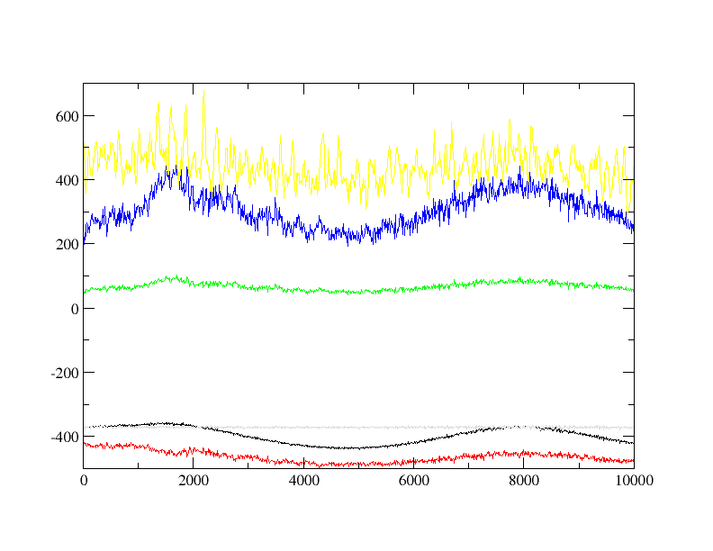

# Converting a protein structure for use with OpenMD

## Background Information

One of the major tasks facing a new user of OpenMD is getting their molecule of choice into a form that can be read by the program. This is never a black box procedure, and will almost always require some hand adjustment of the input files. 

## Instructions

1. Start with a molecular structure in pdb or xyz formats. A good program for generating and optimizing starting structures is Avogadro, which is a wonderful open source molecular editor.

2. Alternatively (and this is the route we’ll take here), you can download a protein structure directly from the Protein Data Bank. We’ve picked a short pentapeptide (the neurotransmitter met-enkephalin) to use as an example. The PDB-ID for this protein is 1PLW. The text version of the PDB file is located in this sample directory.

3. Use the atom2md program to convert the structure into a format that can be read by OpenMD:
    ```
    atom2md -ipdb 1PLW.pdb
    ```
    This command will create an incomplete OpenMD file called `1PLW.omd` that must be edited before it can be used.

4. OpenMD can use the Amber force field for protein simulations. If you are using this force field, the N-terminal and C-terminal ends of the protein should be modified to use the correct atom types. This peptide has the sequence “Tyr-Gly-Gly-Phe-Met”, so Tyrosine is the N-terminal end and Methionine is the C-terminal end.

    In the `omd` file, the atom typing for the first residue must be changed from TYR-X to NTYR-X while for the last residue, it must be changed from MET-X to CMET-X. The special N- and C-terminal atom types usually only apply to the N, CA, C, O, OXT, HN, and HA base types. Other atom types can usually be left alone.

5. Some PDB files specify more details on the atom name record than the Amber force field can use. In particular, the PHE-CD1 and PHE-CD2 types should be down-specified to PHE-CD. Similar down-specification can be done for PHE-CE1, PHE-CE2, PHE-HD1, PHE-HD2, PHE-HE1, PHE-HE2 atom types.

6. At this point it is also a good idea to change the name of the molecule to something descriptive (perhaps “metenk”). This should be done in two places; once in the molecule description and another time in the component block.

7. Before the simulation can run, add a forceField line after the component block:
    ```
    forceField = "Amber";
    ```
    At this stage, you should be able to run OpenMD on the file to check to make sure your hand-crafted atom typing can be matched up with types known by the force field:
    ```
    openmd 1PLW.md
    ```
    Correct any unknown atom types, and repeat until you get an error about the “Integrator Factory”.

8. Add the following lines below the forceField line:
    ```
    ensemble = NVT;
    cutoffMethod = "shifted_force";
    electrostaticScreeningMethod = "damped";
    cutoffRadius = 10;
    dampingAlpha = 0.18;
    targetTemp = 300;
    tauThermostat = 1000;
    dt = 1.0;
    runTime = 1e4;
    tempSet = "false";
    sampleTime = 100;
    statusTime = 10;
    ```

9. The default size for the periodic box or Hmat is typically a tight bounding box around the structure of the protein. Edit the Hmat line in the FrameData block to be at least twice the cutoff radius in each dimension. A good choice for a small bare protein might be:
    ```
    Hmat: {{ 30, 0, 0 }, { 0, 30, 0 }, { 0, 0, 30 }}
    ```

10. Initial configurations that are created from crystal structures usually have no velocity information. To give an initial kick to the atoms (i.e. to sample the velocities from a Maxwell-Boltzmann distribution), you can use the following command:
    ```
    thermalizer -i 1PLW.omd -o warm.omd -t 300
    ```
    This creates a new OpenMD file called `warm.omd` which has initial velocity information.

11. At this stage, a simple simulation can be run:
    ```
    openmd warm.omd
    ```

12. This should complete relatively quickly, and should create a `warm.stat` file as well as a `warm.dump` file containing the actual trajectory.

13. To view the contents of the trajectory file, you’ll need to convert the dump file into something another program can visualize:
    ```
    Dump2XYZ -i warm.dump -b
    ```
    will create a new file `warm.xyz` that can be viewed in VMD and many other chemical structure viewers. The -b flag prints out the 'base' atom types (i.e. the element name) for each atom.

14. The “End-of-Run” file `warm.eor` can be re-purposed as the starting point for a new simulation:
    ```
    cp warm.eor  equilibration.omd
    ```
    Edit the `equilibration.omd` file, and change parameters you’d like to change before running openmd on the new file.

## Expected Output

As mentioned above, you'll notice a few new files in your working directory: `warm.dump`, `warm.eor`, `warm.report`, and `warm.eor`. These files have various uses, as we saw in step 13, running Dump2XYZ creates `warm.xyz` that contains a movie of the NVT simulation you just ran. Looking at this in `jmol` with the following command allows us to visualize this process:

```bash
jmol warm.xyz   ### To run the animation: Tools -> Animate... -> Once
```


The report file contains something like this:

```
###############################################################################
# Status Report:                                                              #
#              Total Time:       10000 fs                                     #
#       Number of Samples:        1001                                        #
#            Total Energy:    -395.377  ±  1.56595      kcal/mol              #
#        Potential Energy:    -462.842  ±  1.12567      kcal/mol              #
#          Kinetic Energy:     67.4643  ±  0.749395     kcal/mol              #
#             Temperature:     305.848  ±  3.39737      K                     #
#                Pressure:     442.269  ±  3.40338      atm                   #
#                  Volume:       27000  ±  0            A^3                   #
#      Conserved Quantity:    -370.851  ±  0.134207     kcal/mol              #
###############################################################################
```

Don't worry if your numbers aren't an exact match with ours, random number generation plays a role in how we got here (`thermalizer`). These are averages and confidence intervals for the thermodynamic quantities we've been tracking throughout the simulation. For the raw data, plot the `warm.stat` file in something like `xmgrace` to see how these thermodynamic quantities change with time:
```
xmgrace -nxy warm.stat
```



In this image, we've hidden the volume as it's on a vastly different scale from our other quantities. Note the fluctuations in temperature (blue) around 300 as our thermostat works on the system.
