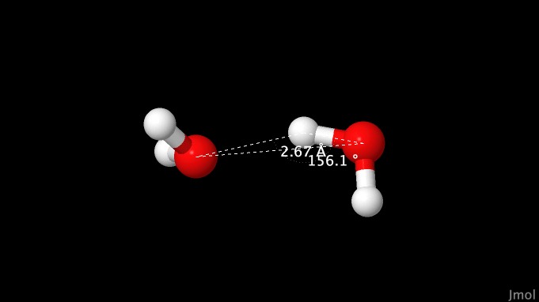
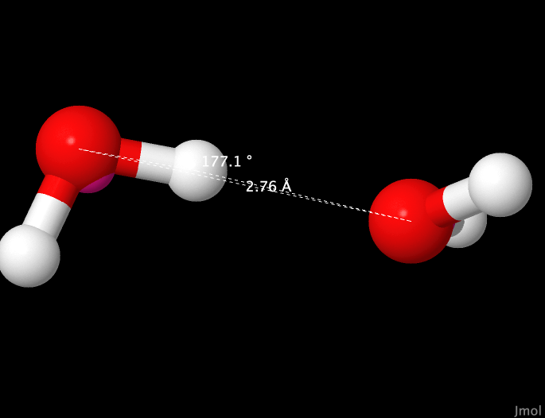
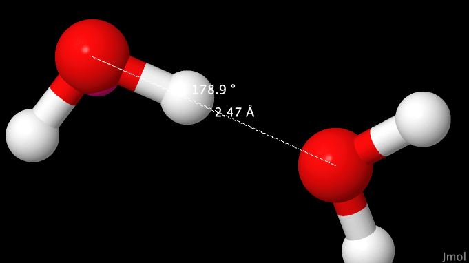
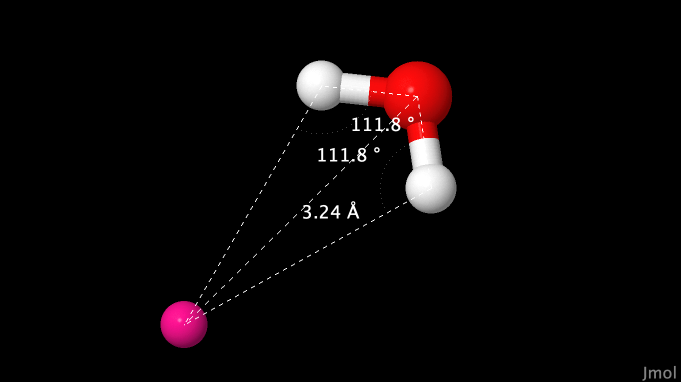

# Annealing of dimer structures

This directory contains very simple starting structures to explore the 
energy minimum for dimers of water with ions or with other water
molecules. Instead of using the minimizer to find the local energy
minimum, we'll instead be using an annealing approach where the target 
temperature of a NVT run is set very low. The only novelty here is in these keywords in the `<MetaData>` section:
```
ensemble = NVT;
targetTemp = 0.001;
tauThermostat = 1e4;
```
## Dimer structures

The following dimer structures are provided,

+ `ssd.omd` - two SSD/E water molecules
+ `two.omd` - two TIP4P water molecules
+ `mix.omd` - one TIP4P and one SSD/E molecule 
+ `cl.omd` - one SSD/E water molecule with a Cl<sup>-</sup> ion

These are largely here to test the geometries of the dimers in two water 
models as well as the cross-interactions between dipolar (SSD/E) and 
charged (TIP4P) models for water, and the ion/water interaction in the 
soft-sticky dipole case.

For more information on the two water models, we suggest:

> Christopher J. Fennell, J. Daniel Gezelter; On the structural and transport properties of the soft sticky dipole and related single-point water models. J. Chem. Phys. 15 May 2004; 120 (19): 9175–9184. [10.1063/1.1697381](https://doi.org/10.1063/1.1697381)

> William L. Jorgensen, Jayaraman Chandrasekhar, Jeffry D. Madura, Roger W. Impey, Michael L. Klein; Comparison of simple potential functions for simulating liquid water. J. Chem. Phys. 15 July 1983; 79 (2): 926–935. [10.1063/1.445869](https://doi.org/10.1063/1.445869) 

## Instructions

These samples all run quite quickly:
```
openmd ssd.omd
openmd two.omd
openmd mix.omd
openmd cl.omd
```
We're going to want to generate `xyz` files of the trajectories, 
```
Dump2XYZ -i ssd.dump
Dump2XYZ -i two.dump
Dump2XYZ -i mix.dump
Dump2XYZ -i cl.omd
```
to see what the dimer geometries at the endpoints look like.

## Expected Output

To look at these simulation trajectories individually, we'd use Jmol:
```
jmol ssd.xyz
```
And then use the *Tools -> Animate -> Go to last frame* menu item. We can 
double click on an atom to start a measurement, so we'll measure two 
things, the Oxygen-Oxygen distance, and the O-H-O angle in the hydrogen 
bond:



which should be 2.26 angstroms and 149.9 degrees, respectively.  For the 
two TIP4P molecules in `two.xyz` we get 2.76 angstroms and 177.1 degrees:



For the mixed case (one SSD/E and one TIP4P) where TIP4P is the H-bond 
acceptor, we get an intermediate structure with 2.72 angstroms and 160.6 
degrees:



And for the Cl<sup>-</sup> ion with the SSD/E molecule, we get a Cl-O 
distance of 3.16 angstroms and an O-H-Cl angle of 178.9 degrees:



It can also be interesting to use the *Tools -> Animate -> Once* command 
to visualize the trajectory itself during an annealing run to very low 
temperature.