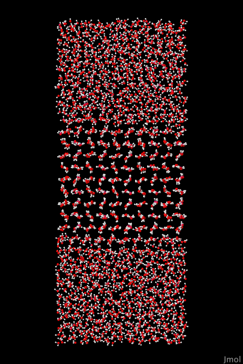
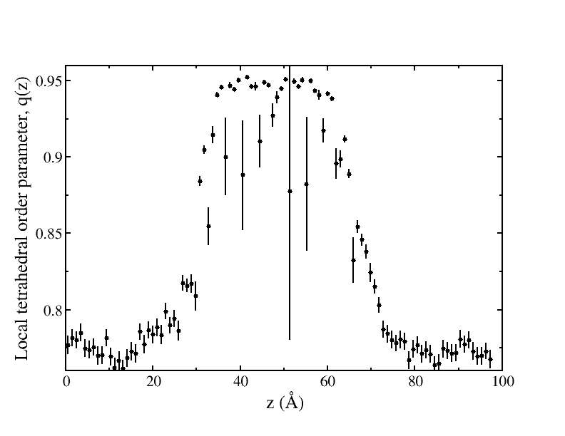
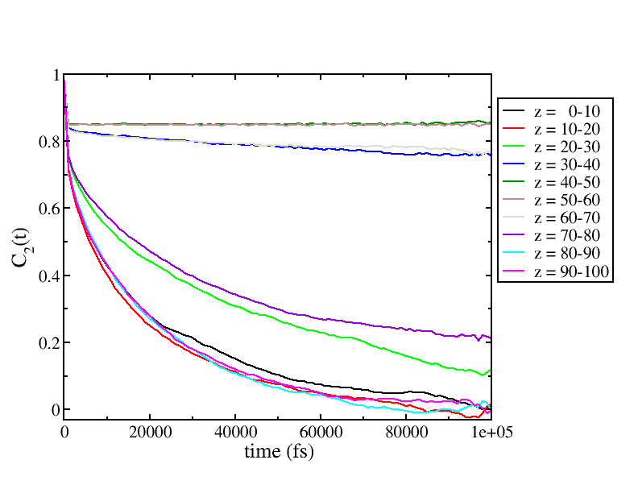

# Structures for simulating Ice-Ih interfaces with liquid water

This directory contains four prepared systems with different ice facets 
exposed to liquid water. They were prepared using a block of Ice-Ih that
has been cleaved along one particular facet. These blocks were then 
rotated so that the prepared facet was oriented to the + and - *z* 
direction of the periodic box, with a vaccuum layer separating periodic 
replicas.  For instructions on preparing these blocks, see the 
[`README.md`](../iceCrystals/README.md) file in the 
[iceCrystals](../iceCrystals) directory.

A second box of liquid water using the same box geometry and water 
model was also prepared, and then the two boxes were combined, eliminating
the liquid phase water molecules wherever they overlapped with ice-phase
molecules.

The systems were equilibrated to a temperature just below the melting
point of the water model. We are using the `TIP4P/Ice` water model which can
be found in this paper:

> J. L. F. Abascal, E. Sanz, R. García Fernández, C. Vega; A potential model for the study of ices and amorphous water: TIP4P/Ice. J. Chem. Phys. 15 June 2005; 122 (23): 234511. [10.1063/1.1931662](https://doi.org/10.1063/1.1931662)

Equilibration was done with a weak thermal flux that was used to
transfer kinetic energy from the ice region into the liquid, keeping the
ice at a slightly lower temperature than the liquid. For the 
simulations in these samples, that flux has been turned off, but 
you can see what was used in previous steps in the `omd` files:

```
RNEMD{
  useRNEMD = false;
  objectSelection = "select TIP4P-Ice_RB_0";
  exchangeTime = 2;
  fluxType = "KE";
  method = "VSS";
  outputBins = 100;
  kineticFlux = -2.0e-6;
  outputFields = "Z|TEMPERATURE|VELOCITY|DENSITY";
}
```
If you want to experiment with reverse non-equilibrium molecular
dynamics (RNEMD), you can change the block above to include
`useRNEMD = true;` which will re-enable the kinetic energy flux.

## Facets of ice

The following solvated ice-Ih facets were prepared:

+ Basal {0001} facet - `solvatedBasal.omd`
+ Prismatic {001̅0} facet - `sovatedPrism.omd`
+ Secondary Prism {112̅0} facet - `sovatedSecPrism.omd`
+ Pyramidal {202̅1} facet - `solvatedPyramidal.omd`

Here's a side view of the solvate basal facet generated with:
```
Dump2XYZ -i solvatedBasal.omd -b -m
jmol solvatedBasal.xyz
```



## Instructions 

We're going to run one 100 ps simulation of a solvated basal facet and then we'll 
analyze the local tetrahedral order parameter during the simulation. **Note
that these simulations are quite large and take a significant amount of processor
time.**

1. First let's run that simulation. If you have more than 4 processors available, now
would be a good time to use them:

```
mpirun -np 4 openmd_MPI solvatedBasal.omd
```

2. If all went well, you should get a report showing that the average temperature stayed 
at 267 K, just below the melting point:
```
###############################################################################
# Status Report:                                                              #
#              Total Time:      100000 fs                                     #
#       Number of Samples:        1001                                        #
#            Total Energy:    -32337.2  ±  0.0321297    kcal/mol              #
#        Potential Energy:    -36710.2  ±  2.434        kcal/mol              #
#          Kinetic Energy:     4372.96  ±  2.41372      kcal/mol              #
#             Temperature:      267.17  ±  0.147468     K                     #
#                Pressure:    -127.229  ±  13.4759      atm                   #
#                  Volume:       88632  ±  0            A^3                   #
#      Conserved Quantity:    -32337.2  ±  0.0321297    kcal/mol              #
#                         ⎡-8.86885e-07  1.17242e-07  1.48842e-07⎤            #
#         Pressure Tensor:⎢ 3.78971e-08 -9.46811e-07  2.84897e-08⎥ amu/fs^2/A #
#                         ⎣ 8.55982e-08 -4.30362e-08 -4.95334e-07⎦            #
#                                 ⎡ 1.24786e-07  9.64758e-08  9.37638e-08⎤    #
#                              ±  ⎢ 9.06544e-08  1.22531e-07  9.10685e-08⎥    #
#                                 ⎣  9.0854e-08  8.90214e-08    1.362e-07⎦    #
###############################################################################
```

3. Next, we're going to query the local tetrahedral order parameter.  This parameter is 
near 1 for water molecules that have tetrahedral arrangements of neighbors, and is much 
lower for molecules in the liquid phase.  It is a good way of looking at the interfacial 
width of a ice/water interface.  Note that this is the tetrahedrality for the Oxygens 
using other Oxygens to define the neighbors, and a cutoff of 3.5 angstroms for defining
the group of nearest neighbors:

```
StaticProps -i solvatedBasal.dump --tet_param_z --sele1="select O_TIP4P-Ice" --sele2="select O_TIP4P-Ice" --rcut=3.5
```

More details on the tetrahedral order parameter can be found in these references:

> "A new order parameter for tetrahedral configurations," by P.-L. Chau and A.J. Hardwick, Mol. Phys. 93, pp. 511-518 (1998).

and

> "Relationship between structural order and the anomalies of liquid water," by J.R. Errington and P.G. Debenedetti, Nature 409, pp. 318-321 (2001).

and 

> "Space-time correlations in the orientational order parameter and the orientational entropy of water," by P. Kumar, S.V. Buldyrev, and H.E. Stanley, arXiv:0807.4699v1 

4. Finally, we'll calculate at the *z*-dependencce of the orientational correlation 
function of the water molecules. Here, we use the 2nd order Legendre polynomial of a 
unit vector on the molecule, $\mathbf{\hat{u}}$, dotted with itself at a later time.

$$
C_2(t) = \frac{1}{2} \langle 3 (\mathbf{\hat{u}}(t) \cdot \mathbf{\hat{u}}(0))^2 - 1 \rangle
$$

Note that the box is approximately 100 angstroms in 
*z*, so this computes the orientational correlations in 10 angstrom slabs:

```
DynamicProps -i solvatedBasal.dump --lcorrZ --order=2 --sele1="select TIP4P-Ice_RB_0" --nzbins=10
```

### Expected Results
The tetrahedral order parameter can be plotted (with error bars) like this:
```
xmgrace -settype xydy solvatedBasal.Qz
```
You should get a plot that looks like this:




The orientational correlation function data has multiple sets, each representing one of the 10 slabs:
```
xmgrace -nxy solvatedBasal.lcorrZ
```


Note that the correlation functions from the slabs in the ice don't decay very much, while 
in the liquid regions, the orientational decay is nearly complete after 100 ps.
