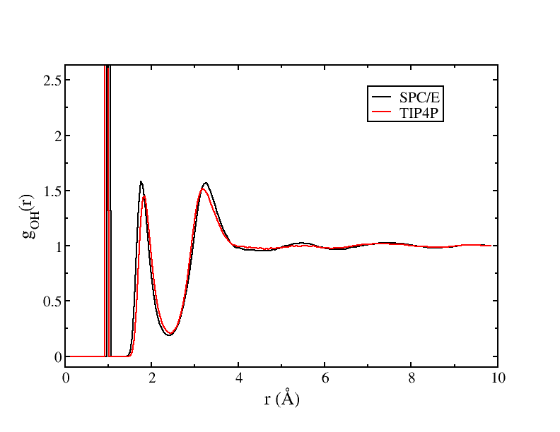
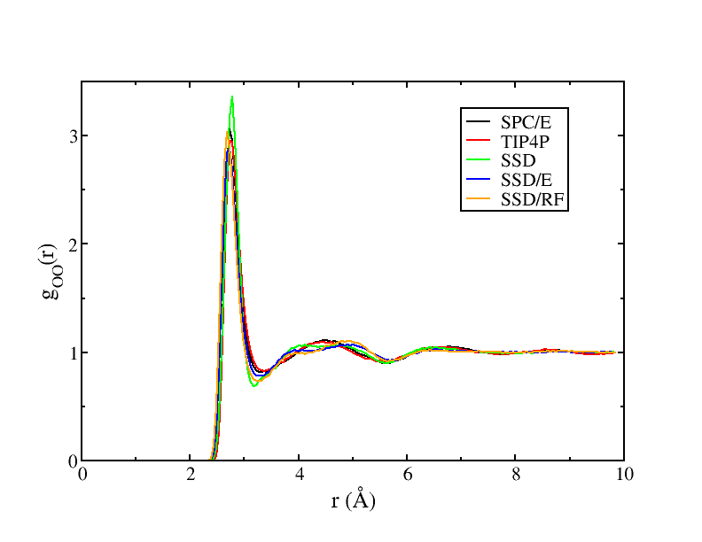
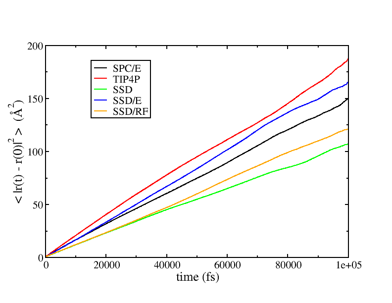
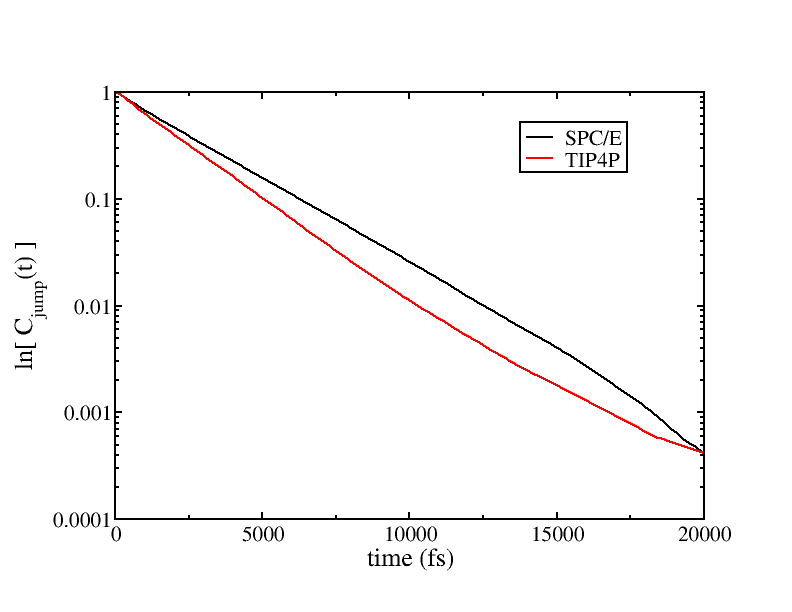

# Liquid water simulations with five water models

## Background Information

This directory contains equilibrated configurations for simulating
liquid water with five different water models, SPC/E and TIP4P, which 
are multi-site models, and SSD, SSD/E, and SSD/RF which are single-site 
models. These simulations are relatively small (256 molecules) and in 
periodic box that is 19.7 angstroms on a side. We'll carry out a 
relatively short (1e5 fs = 100ps) simulation and concentrate on how 
to extract interesting data from the trajectories. One interesting observation
is that the SSD-based simulations run roughly 9-16 times faster than the
multi-site simulations.

The SSD/RF model was tuned for use with a reaction field for electrostatic 
interactions, so you might note that the `ssdrf.omd` file has these 
parameters:
```C++
electrostaticSummationMethod = "reaction_field";
electrostaticScreeningMethod = "undamped";
dielectric = 80.0;
cutoffRadius = 9.0;
```
while the other simulations use:
```C++
cutoffMethod = "shifted_force";
electrostaticScreeningMethod = "damped";
dampingAlpha = 0.18;
cutoffRadius = 9.0;
```

Because we're going to extract some time correlation function information,
we're doing these simulations in the NVE ensemble, and we're going to sample
configurations frequently enough to generate some useful time correlation
functions.  Here are the relevant keywords in the `<MetaData>` section:
```C++
ensemble = NVE;
runTime = 1e5;
sampleTime = 100;
statusTime = 10;
```

### The water models

The following equilibrated liquid configurations are provided,

+ `spce.omd` - SPC/E 3-site water molecules
+ `tp4.omd` - TIP4P 4-site water molecules
+ `ssd.omd` - SSD single site water molecules
+ `ssde.omd` - SSD/E single site water molecules
+ `ssdrf.omd` - SSD/RF single site water molecules

For more information on the water models, we suggest:

> The missing term in effective pair potentials H. J. C. Berendsen, J. R. Grigera, and T. P. Straatsma, The Journal of Physical Chemistry 1987 91 (24), 6269-6271, DOI: [10.1021/j100308a038](https://doi.org/10.1021/j100308a038) |

and 

> William L. Jorgensen, Jayaraman Chandrasekhar, Jeffry D. Madura, Roger W. Impey, Michael L. Klein; Comparison of simple potential functions for simulating liquid water. J. Chem. Phys. 15 July 1983; 79 (2): 926–935. DOI: [10.1063/1.445869](https://doi.org/10.1063/1.445869) 

and 

> Ming-Liang Tan, Justin T. Fischer, Amalendu Chandra, Bernard R. Brooks, Toshiko Ichiye,
A temperature of maximum density in soft sticky dipole water, Chemical Physics Letters,
376(5–6), pp. 646-652 (2003). DOI: [10.1016/S0009-2614(03)01044-3](https://doi.org/10.1016/S0009-2614(03)01044-3) 

and

> Christopher J. Fennell, J. Daniel Gezelter; On the structural and transport properties of the soft sticky dipole and related single-point water models. J. Chem. Phys. 15 May 2004; 120 (19): 9175–9184. DOI: [10.1063/1.1697381](https://doi.org/10.1063/1.1697381) 

## Instructions

These samples will be run with multiple processors:
```bash
mpirun -np 4 openmd_MPI spce.omd
mpirun -np 4 openmd_MPI tp4.omd
mpirun -np 4 openmd_MPI ssd.omd
mpirun -np 4 openmd_MPI ssde.omd
mpirun -np 4 openmd_MPI ssdrf.omd
```
We're going to want to query the Oxygen-Oxygen and Oxygen-Hydrogen radial distribution functions, $g(r)$ for the single site models.  This property is a static property (depends only on individual configurations), so we use `StaticProps`
```bash
StaticProps -i spce.dump --gofr --sele1="select O_SPCE" --sele2="select O_SPCE" -o spce.gOO --nbins=200
StaticProps -i spce.dump --gofr --sele1="select O_SPCE" --sele2="select H_SPCE" -o spce.gOH --nbins=200
StaticProps -i tp4.dump --gofr --sele1="select O_TIP4P" --sele2="select O_TIP4P" -o tp4.gOO --nbins=200
StaticProps -i tp4.dump --gofr --sele1="select O_TIP4P" --sele2="select H_TIP4P" -o tp4.gOH --nbins=200
```
to see what the liquid structure looks like under these simulation conditions.  Let's 
plot some of these to see subtle differences in $g_{OH}(r)$:

```bash
xmgrace spce.gOH tp4.gOH
``` 


The single-site models (SSD, SSD/E, and SSD/RF) don't have explicit Oxygen or 
Hydrogen atoms, but we can still look at radial distribution functions for 
their centers of mass:
```bash
StaticProps -i ssd.dump --gofr  -o ssd.gOO --nbins=200
StaticProps -i ssde.dump --gofr  -o ssde.gOO --nbins=200
StaticProps -i ssdrf.dump --gofr  -o ssdrf.gOO --nbins=200
```
to see what the liquid structure looks like with these models.  Let's 
plot some of these to see differences in $g_{OO}(r)$:

```bash
xmgrace spce.gOO tp4.gOO ssd.gOO ssde.gOO ssdrf.gOO
``` 



## Time correlation functions

To carry out time correlation functions, we're going to use `DynamicProps` as these 
correlate information between configurations. First, we're going to calculate the mean 
squared displacement, $\langle |r(t) - r(0)|^2 \rangle$:

```bash
DynamicProps -i spce.dump --rcorr
DynamicProps -i tp4.dump --rcorr
DynamicProps -i ssd.dump --rcorr
DynamicProps -i ssde.dump --rcorr
DynamicProps -i ssdrf.dump --rcorr
```

And then we're going to compute the hydrogen bond 'jump' correlation function:
```bash
DynamicProps -i spce.dump --jumptime
DynamicProps -i tp4.dump --jumptime
```

## Expected output

First let's look at the mean squared displacement results for these four water models:

```bash
xmgrace spce.rcorr tp4.rcorr ssd.rcorr ssde.rcorr ssdrf.rcorr
``` 



Note that the SSD/E model nearly reproduces the transport properties of the much 
more expensive SPC/E model.

Next, we'll look at the Hydrogen bond jump times for the two multi-site models:
```bash
xmgrace -log y spce.jump tp4.jump
```
We'll need to zoom in to the short time portion (< 20000 fs):



but you should be able to see nearly linear decay (on a log plot) of the jump time 
correlation function. Fitting the exponential decay of this correlation function will
help extract a H-bond jump time for these models.
