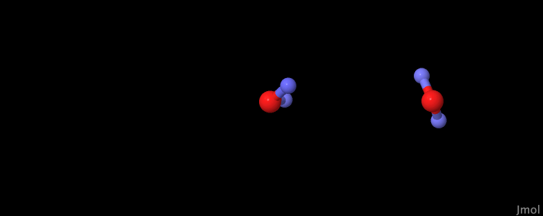
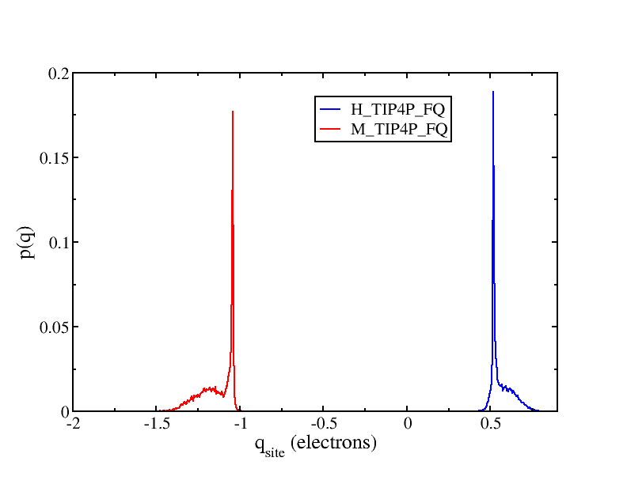

# TIP4P-fq,  a Fluctuating charge (*fluc-q*) model for water

This directory contains a [force field file](tip4p-fq.frc) and structures which 
allow exploration of fluctuating charge models for water.  These 
models have extra charge degrees of freedom attached to charged 
atoms, and the charges can change dynamically just like other 
coordinates.  We're using the parameters given in:

>  Steven W. Rick, Steven J. Stuart, B. J. Berne; Dynamical fluctuating charge force fields: Application to liquid water. J. Chem. Phys. 1994;  101 (7): pp. 6141–6156. https://doi.org/10.1063/1.468398

The main thing to note in these files is the addition of a fluctuating
charge `<MetaData>` section,

```
flucQ {
 propagator = "NVT";
 targetTemp = 10.0;
 tauThermostat = 1000.0;
 dragCoefficient = 0.0001;
}
```
which governs how OpenMD propagates the extra charge degrees of
freedom on the atomic sites.

The [`tip4p-fq.frc`](tip4p-fq.frc) contains all of the parameters for the
atom types, and the individual `omd` files all have molecule definitions that
are worth looking at.  The [`1Water_FQ.omd`](1Water_FQ.omd) file describes
a single TIP4P-FQ molecule.  Note the `constrainTotalCharge = true;` option in the
molecule definition. This is not present in the [`2waterFQ.omd`](2waterFQ.omd) file, 
which will then allow some charge to migrate between the two water molecules.

Another interesting feature highlighted in these examples is the `<SiteData>` section
of the `dump` and `eor` files.  The positions and orientations of the molecules
themselves are managed in the `<StuntDoubles>` section, but individual atomic sites
on the molecules now have extra data, including charges and charge velocities.  Here's
a brief extract of a liquid-phase `<SiteData>`:

```
    <SiteData>
         0                    
         0          0      cw   0.000000e+00   0.000000e+00 
         0          1      cw   5.232053e-01  -1.422360e-03 
         0          2      cw   5.258282e-01  -2.247069e-03 
         0          3      cw  -1.049033e+00   3.669429e-03 
         1                    
         1          0      cw   0.000000e+00   0.000000e+00 
         1          1      cw   5.198788e-01   7.494833e-03 
         1          2      cw   5.242525e-01  -8.152392e-03 
         1          3      cw  -1.044131e+00   6.575591e-04 
```

There are two integers on many of the lines.  The first is the globalID of the 
`StuntDouble` while the second is the index of the atomic site belonging to that 
StuntDouble.  What follows is then the charge `c` (in electrons) and charge velocity `w` 
(in electrons / fs).  Note that in the bulk liquid phase, the TIP4P-fq molecules become 
much more polarized than when they are isolated. Here's the corresponding section from 
the `1Water_FQ.eor` file:

```
    <SiteData>
         0                    
         0          0      cw   0.000000e+00   0.000000e+00 
         0          1      cw   4.445601e-01  -2.907747e-05 
         0          2      cw   4.445601e-01  -2.907747e-05 
         0          3      cw  -8.888336e-01   5.815494e-05 
    </SiteData>
```
Note the lower charges on the isolated water molecule.

## Instructions

These samples all run quite quickly:
```
openmd 1Water_FQ.omd
openmd 2waterFQ.omd
mpirun -np 4 openmd_MPI water-fq.omd
```
We're going to want to generate `xyz` files of the trajectories, adding 
charges to track how these change over time:
```
Dump2XYZ -i 1Water_FQ.dump -m -b -c
Dump2XYZ -i 2waterFQ.dump -m -b -c
Dump2XYZ -i water-fq.dump -m -b -c
```

## Expected Output

To look at these simulation trajectories individually, we'd use Jmol:
```
jmol 2waterFQ.xyz
```

A very useful command in jmol is
- *File -> Console...*

In the console window, type `color partialCharge` and hit return.  The blue colors 
indicate atoms that have taken on a positive partial charge, and the red colors are 
atoms with negative partial charges.



Next use the *Tools -> Animate -> Once* menu item. This will animate the entire 
trajectory, and the colors of the atoms should indicate the fluctuations that
are taking place throughout the trajectory..

We can also calculate the distributions of partial charge values that the water molecules
take on during the simulation:
```
StaticProps -i water-fq.dump -q --sele1="select H_TIP4P_FQ" -o water-fq.ChargeHistH
StaticProps -i water-fq.dump -q --sele1="select M_TIP4P_FQ" -o water-fq.ChargeHistM
xmgrace water-fq.ChargeHistH water-fq.ChargeHistM
```



