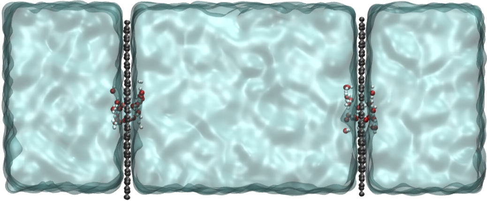

# Z-Constraints

## Background Information

Z-constraints fix the $z$ coordinates of a given molecule with respect to the center of the mass of the system. This is a technique that was developed to obtain the forces required for the force auto-correlation calculations,[^1] originally proposed by Roux and Karplus to investigate the dynamics of ions inside ion channels.[^2]
After the force calculation, the total force on molecule $\alpha$ is:

$$G_{\alpha} = \sum_i F_{\alpha i}$$

where $F_{\alpha i}$ is the force in the $z$ direction on atom $i$ in $z$-constrained molecule $\alpha$. The forces on the atoms in the $z$-constrained molecule are then adjusted to remove the total force on molecule $\alpha$:

$$F_{\alpha i} = F_{\alpha i} -  \frac{m_{\alpha i} G_{\alpha}}{\sum_i m_{\alpha i}}$$

Adjustments are also made to the velocities to keep the centers of mass of the NPG sheets fixed, and the accumulated constraint forces from both membranes are also subtracted from unconstrained liquid phase molecules to keep the system center of mass of the entire system from drifting. 

The average pressure on each of the two nanoporous graphene sheets can be computed easily from the time averages of the constraint forces that have been applied to keep them in place, so the mean pressure difference between the two regions,

$$\Delta P = P_\beta - P_\alpha = \frac{\left( \left< G_\beta \right> - \left< G_\alpha \right> \right)}{L_x L_y}$$

Note that $\Delta P$ is the hydraulic pressure difference that develops as a result of applying a steady-state particle flux between the two regions.

## Instructions

To test the z-constraint method, we have an equilibrated solution of SPC/E water with two nanoporous graphene (NPG) sheets sitting at 25% and 75% of the box length in z. Z-constraints are applied to fix these graphene sheets according to the following additions to the `.omd` file:

```
zconsTime = 1;
zconsTol = 0.01;

zconstraint {
  molIndex = 0;
  kRatio = 0.5;
  zPos = -27.5115;
}

zconstraint {
  molIndex = 1;
  kRatio = 0.5;
  zPos = 27.8143;
}
```

Since this simulation box is already equilibrated, we don't need to do anything but run it.

```bash
mpirun -np 4 openmd_MPI waterWithP28.omd
```

## Expected Output

A visualization of the simulation is shown here, rendered with VMD.



Of note with this example is a new file type you may notice: `.fz`. This is a rather interesting file to parse, but it contains all the relevant information for how the z-constraints were applied at each time step. Averaging out the forces and then summing over the two constraints gives an estimate of the total force required to constrain our two molecules. Converting this to a pressure using the area gives ~629 bar.

## References

[^1]: Merdaw, A. A.; Sharif, A. O.; Derwish, G. A. W. Water permeability in polymeric membranes, Part I. *Desalination* **2010**, 260, 180–192.

[^2]: Roux, B.; Karplus, M. Ion Transport in a Gramicidin-Like Channel: Dynamics and Mobility. *J. Phys. Chem.* **1991**, 95, 4856–4868.
