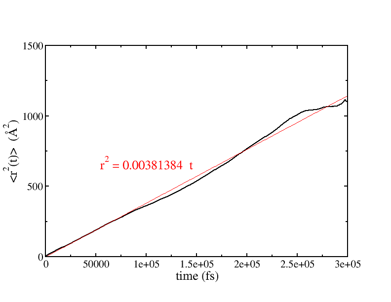

# Zeolite

## Background Information

OpenMD supports the **CLAYFF** forcefield described in: "Molecular
Models of Hydroxide, Oxyhydroxide, and Clay Phases and the Development
of a General Force Field," Randall T. Cygan, Jian-Jie Liang, and
Andrey G. Kalinichev, *J. Phys. Chem. B* **108**, pp. 1255-1266 (2004)
DOI: [10.1021/jp0363287](https://doi.org/10.1021/jp0363287).

This directory provides an example of a solvated ZSM-5 zeolite
structure that has a 36 water molecules loaded into the structure.
is simulated using the CLAYFF force field in the microcanonical
(constant-NVE) ensemble.

## Instructions

To run this simulation (which is a bit long), we would do:
```
mpirun -np 4 openmd_MPI zsm5_loaded.omd
```

This command will run a 300ps (150,000 step) simulation and sample the configurations
every 0.5 ps to a `dump` file.  We can watch a movie of what happens during the
simulation by creating an `xyz` file from the `dump` file:

```
Dump2XYZ -i zsm5_loaded.dump -b -m
jmol zsm5_loaded.xyz
```

A helpful jmol command to watch the progession of the simulation:
- *Tools -> Animate... -> Once*

The dynamics should show significant diffusion of the water
molecules through the larger zeolite pores. Once the simulation has
completed, we can also go back and measure the mean squared
displacement of the water molecules in this environment:

```
DynamicProps -i zsm5_loaded.dump --rcorr --sele1="select SPC"
xmgrace zsm5_loaded.rcorr
```

To calculate diffusivity, we need the slope of the mean squared
displacement (rcorr) that was generated by `DynamicProps`,
$$ D = \lim_{t \rightarrow \infty} \frac{1}{6 t} \langle | r(t) - r(0)
|^2 \rangle $$

## Expected Output
The thermodynamic quantities reported at the end of the simulation
should look something like:
```
###############################################################################
# Status Report:                                                              #
#              Total Time:      300000 fs                                     #
#       Number of Samples:       30001                                        #
#            Total Energy:     -159405  ±  0.00241096   kcal/mol              #
#        Potential Energy:     -159994  ±  0.155874     kcal/mol              #
#          Kinetic Energy:     588.836  ±  0.154339     kcal/mol              #
#             Temperature:     305.319  ±  0.0800269    K                     #
#                Pressure:     140.652  ±  11.2009      atm                   #
#                  Volume:       15765  ±  0            A^3                   #
#      Conserved Quantity:     -159405  ±  0.00241096   kcal/mol              #
###############################################################################
```

Note the very small variation in the Total Energy, Volume, and Conserved
Quantity fields, which is expected in a NVE simulation. 


The mean
squared displacment (rcorr) file is easily fit with a line to show a
diffusion constant, 

$$D = \frac{1}{6} * 0.00381384 \text{ Angstroms}^2 \text{ fs}^{-1} =
6.4 \times 10^{-9} \text{ m}^2 \text{ s}^{-1}$$

A plot of the expected `rcorr` data along with the linear fit is shown below:


